# PromptForge — AWS SBG
# Page Architecture & UX Specification

> **Purpose:** Define the page structure, navigation architecture, page-by-page layout, user journeys, component responsibilities, and interaction model for the PromptForge MVP.

---

## 1. Product Context

**PromptForge** is an organization-specific AI prompt library for the AWS Student Builder Group (AWS SBG).

The MVP does not execute prompts or communicate with LLM APIs. It helps users:

1. Discover the right prompt.
2. Understand what the prompt is for.
3. Learn how to use it.
4. See a realistic example.
5. Select ChatGPT or Gemini.
6. Copy the appropriate prompt.
7. Paste it into their chosen LLM.

The central UX objective is:

> **Get the user from "I need to do something" to "I have the right prompt copied" as quickly as possible.**

---

# 2. UX Principles

### 2.1 Task-first, not prompt-first

Users should not have to understand prompt terminology.

Bad:

> "Browse our prompt templates."

Better:

> "What do you want to do?"

### 2.2 Fast discovery

A common prompt should ideally be reachable within:

```text
Landing Page → Search / Category → Prompt
```

### 2.3 Explain before asking the user to copy

A prompt should not be presented as unexplained raw text. Users should understand:

- What it does.
- When to use it.
- What information they need.
- How to customize it.

### 2.4 Examples are part of the product

Every important prompt should have at least one realistic example:

```text
Scenario → Inputs → Completed Prompt → Expected Output
```

### 2.5 LLM choice should be obvious

ChatGPT and Gemini should be two variants of the same task, not separate navigation paths.

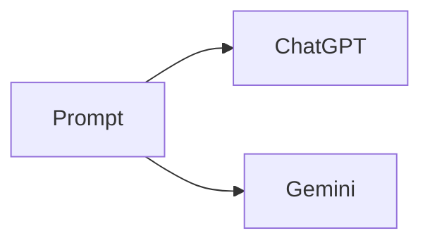

### 2.6 Minimize cognitive load

The application should feel like a polished productivity toolkit, not an administration dashboard.

---

# 3. Global Application Architecture

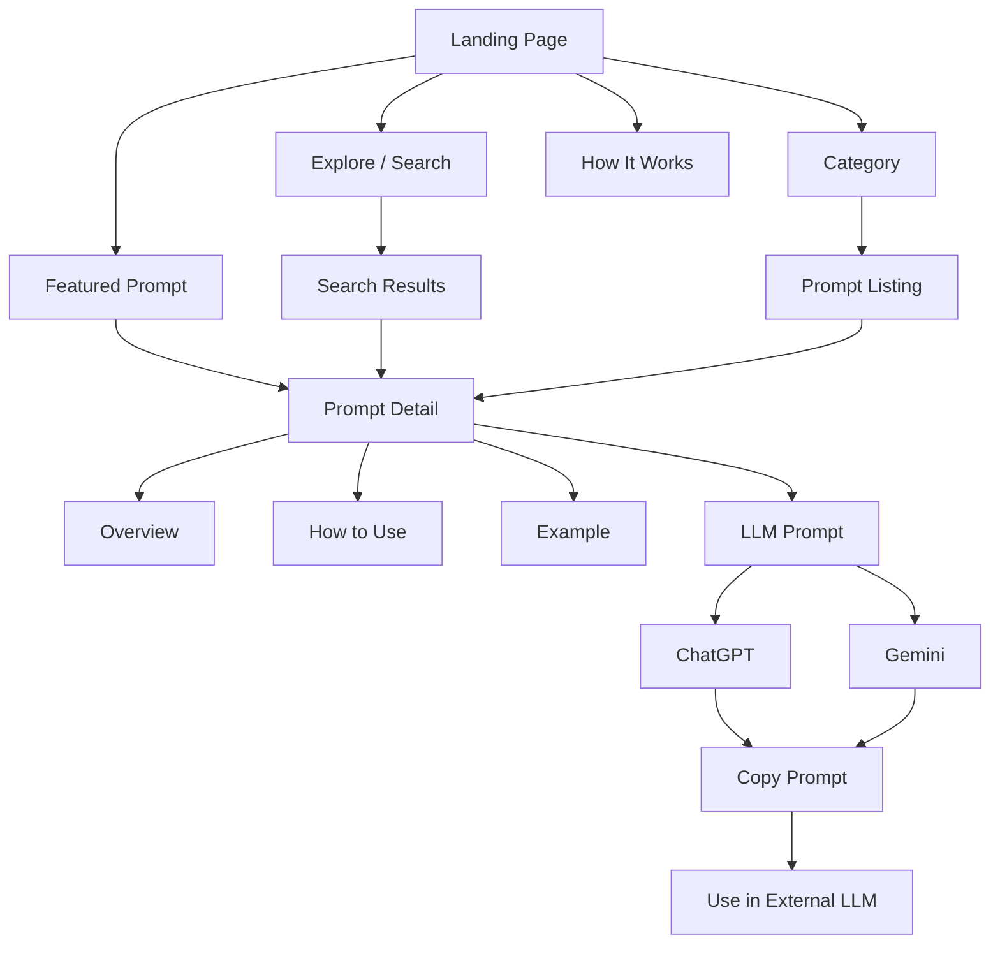

---

# 4. MVP Route Map

```text
/
├── /explore
├── /search
├── /category/:categorySlug
├── /prompt/:promptSlug
├── /favorites
├── /recent
└── /how-it-works
```

Optional:

```text
/404
```

Prompt pages must be directly shareable.

---

# 5. Global Layout

Desktop:

```text
┌──────────────────────────────────────────────────────────────┐
│ Logo     Explore   Categories   Favorites   Recent   Search │
├──────────────────────────────────────────────────────────────┤
│                                                              │
│                       PAGE CONTENT                           │
│                                                              │
└──────────────────────────────────────────────────────────────┘
```

Mobile:

```text
┌───────────────────────────────┐
│ Logo              Search  ☰  │
└───────────────────────────────┘
```

The header should remain consistent across pages.

---

# 6. Landing Page

Route:

```text
/
```

The landing page is the most important discovery surface.

## Primary objective

Answer:

> "What can I use this for?"

and immediately provide:

> "Where is the prompt I need?"

### 6.1 Hero

```text
                    PROMPTFORGE

        Your AI Prompt Toolkit for AWS SBG

 Find reusable prompts for communication, events,
 content, presentations, coding, AWS and more.

        ┌───────────────────────────────────┐
        │ What do you want to do?       🔍  │
        └───────────────────────────────────┘

      [ Explore Prompts ]   [ How It Works ]
```

The search field should be the dominant interaction.

Users should be able to type:

- "Write an email"
- "Make a LinkedIn post"
- "Debug code"
- "Create PPT"
- "Plan an event"
- "Make a poster"

---

# 7. Landing Page — Categories

Show major task categories as visually distinct cards.

```text
Explore by task

┌──────────────┐ ┌──────────────┐ ┌──────────────┐
│ Communication│ │   Content    │ │    Events    │
│ Emails       │ │ LinkedIn     │ │ Planning     │
│ Letters      │ │ Social       │ │ Agendas      │
└──────────────┘ └──────────────┘ └──────────────┘

┌──────────────┐ ┌──────────────┐ ┌──────────────┐
│ Presentations│ │  Creatives   │ │  Technical   │
│ PPT          │ │ Posters      │ │ Coding       │
│ Slides       │ │ Images       │ │ Debugging    │
└──────────────┘ └──────────────┘ └──────────────┘
```

Initial categories:

- Communication
- Content & Social Media
- Events
- Presentations
- Design & Creatives
- Technical
- AWS & Cloud
- Career

---

# 8. Landing Page — Popular Prompts

Display 6–8 manually selected high-value prompts.

Examples:

- Draft Professional Email
- Create LinkedIn Post
- Plan Technical Event
- Generate PPT Content
- Debug Code
- Create Poster Concept

Each card should have a direct **View Prompt →** action.

---

# 9. Landing Page — Recently Used

If localStorage contains recently viewed prompts:

> **Continue where you left off**

Show 3–5 recent prompts.

If there is no history, omit the section rather than showing an empty state.

---

# 10. Landing Page — How It Works

Use a simple three-step explanation:

```text
01  Find
    Find the prompt for your task.

        ↓

02  Customize
    Replace placeholders with your information.

        ↓

03  Copy
    Choose ChatGPT or Gemini and copy the prompt.
```

---

# 11. Landing Page — Footer

```text
PromptForge
AI Prompt Toolkit for AWS SBG

Explore
Categories
Favorites
How It Works

Built for AWS SBG
```

The application must not imply official AWS ownership or endorsement.

---

# 12. Explore Page

Route:

```text
/explore
```

Purpose: provide a complete overview of available prompts.

```text
Explore Prompts

[ Search prompts... ]

[All] [Communication] [Content] [Events] [Technical] ...

────────────────────────────────────────

Showing 24 prompts

┌──────────┐ ┌──────────┐ ┌──────────┐
│ Prompt   │ │ Prompt   │ │ Prompt   │
│ Card     │ │ Card     │ │ Card     │
└──────────┘ └──────────┘ └──────────┘
```

MVP filters:

- Category
- LLM availability
- Featured

Avoid excessive filtering.

---

# 13. Search Experience

Search should be client-side and effectively instantaneous.

Search across:

- Title
- Description
- Category
- Tags
- Keywords

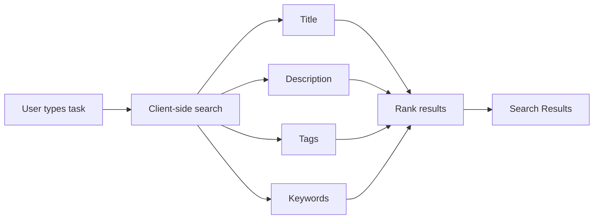

Search ranking should prioritize:

1. Exact title match.
2. Title partial match.
3. Tags.
4. Category.
5. Description.
6. Keywords.

---

# 14. Search Results Page

Route:

```text
/search?q=linkedin
```

Layout:

```text
Search

[ linkedin                              ]

12 prompts found

Best matches

┌───────────────────────────────────────┐
│ Create LinkedIn Post                  │
│ Create professional LinkedIn content │
│ Content · Social Media               │
│                                       │
│ ChatGPT · Gemini          View →     │
└───────────────────────────────────────┘
```

---

# 15. Category Page

Route:

```text
/category/:categorySlug
```

Example:

```text
/category/communication
```

Layout:

```text
Communication

Create better communication faster.

[ Search within Communication ]

────────────────────────────────

Emails
Letters
Announcements
WhatsApp

────────────────────────────────

Prompt Cards
```

The category description should briefly explain what users can accomplish.

---

# 16. Prompt Card

Each prompt card should contain:

```text
┌──────────────────────────────────────┐
│ ICON  Communication              ☆  │
│                                      │
│ Draft Professional Email             │
│                                      │
│ Write clear, formal emails for       │
│ organizational communication.        │
│                                      │
│ #email #formal #communication        │
│                                      │
│ ChatGPT   Gemini                     │
│                                      │
│                         View →       │
└──────────────────────────────────────┘
```

Interactions:

- Hover: subtle elevation/border transition.
- Click: navigate to prompt detail.
- Favorite: toggle without triggering navigation.

---

# 17. Prompt Detail Page

Route:

```text
/prompt/:promptSlug
```

This is the core functional page.

Primary objective:

> Turn a discovered prompt into a usable prompt with minimal confusion.

---

# 18. Prompt Detail — Header

```text
← Communication

Draft Professional Email

Create a clear, professional email for
institutional or organizational communication.

[ ☆ Favorite ]

Tags:
#email  #formal  #communication
```

The category breadcrumb should be clickable.

---

# 19. Prompt Detail — LLM Selector

Place the LLM selector close to the prompt workspace:

```text
Use with

[ ChatGPT ] [ Gemini ]
```

The selected option should have strong visual indication.

Switching must not reload the page.

---

# 20. Prompt Detail — Overview

Section:

> **What does this prompt do?**

Provide a short explanation.

Example:

> This prompt helps you create a professional email by structuring the recipient, purpose, context, tone, and required information before generating the final message.

---

# 21. Prompt Detail — When to Use

Section:

> **When should I use it?**

Use concise bullets.

Example:

- Faculty communication.
- Event-related emails.
- Student announcements.
- External communication.

Optionally include:

> **Don't use it for:** casual personal emails.

---

# 22. Prompt Detail — How to Use

Section:

> **How to use this prompt**

```text
01  Gather the required information.

02  Replace every {{PLACEHOLDER}}.

03  Select ChatGPT or Gemini.

04  Copy the completed prompt.

05  Paste it into the selected LLM.

06  Review the generated result.
```

This should be understandable without external training.

---

# 23. Prompt Detail — Required Information

Section:

> **What you'll need**

Example:

```text
┌─────────────────────────────────┐
│ Recipient                       │
│ Person receiving the email      │
│ Example: Head of Department     │
└─────────────────────────────────┘

┌─────────────────────────────────┐
│ Purpose                         │
│ Why the email is being written  │
│ Example: Request permission     │
└─────────────────────────────────┘
```

This lets users prepare their information before copying.

---

# 24. Prompt Detail — Example

Every prompt must have at least one realistic example.

Structure:

```text
Example

Scenario
────────────────────────────
You need to request permission
to conduct a technical workshop.

Input
────────────────────────────
Recipient: Head of Department
Event: AWS Cloud Workshop
Date: 15 September 2026
Venue: Seminar Hall

Completed Prompt
────────────────────────────
[ Expand / View ]

Expected Result
────────────────────────────
A formal permission request email
with the provided information.
```

The example must be visually distinct from the reusable prompt.

---

# 25. Prompt Detail — Prompt Workspace

This is the primary action area.

```text
Your Prompt

Use with:

[ ChatGPT ] [ Gemini ]

┌──────────────────────────────────────────┐
│ You are an expert...                     │
│                                          │
│ Event: {{EVENT_NAME}}                    │
│ Date: {{EVENT_DATE}}                     │
│ ...                                      │
└──────────────────────────────────────────┘

                    [ Copy Prompt ]
```

The prompt viewer should preserve line breaks and formatting.

---

# 26. Placeholder Highlighting

Use:

```text
{{PLACEHOLDER_NAME}}
```

Placeholders should be visually highlighted.

Example:

```text
Event:
{{EVENT_NAME}}

Date:
{{EVENT_DATE}}

Venue:
{{VENUE}}
```

The visual treatment should make it immediately obvious what the user needs to replace.

---

# 27. Copy Interaction

When clicked:

```text
Copy Prompt
     ↓
✓ Copied!
```

The feedback should last approximately 1.5–2 seconds.

Optional micro-interaction:

```text
Copy icon → Check icon
```

The prompt should remain visible.

---

# 28. Placeholder Warning

Before copying, detect whether placeholders remain.

Example:

```text
⚠ 3 placeholders still need to be replaced.
```

The user may still copy the prompt.

This prevents accidental incomplete prompts without blocking the workflow.

---

# 29. Desktop Prompt Detail Layout

Recommended two-column layout:

```text
┌───────────────────────────────┬─────────────────────────┐
│ What it does                  │ Your Prompt             │
│                               │                         │
│ When to use                   │ [ChatGPT] [Gemini]     │
│                               │                         │
│ How to use                    │ ┌─────────────────────┐ │
│                               │ │ Prompt              │ │
│ Required information          │ │                     │ │
│                               │ └─────────────────────┘ │
│                               │                         │
│ Example                       │ [ Copy Prompt ]        │
└───────────────────────────────┴─────────────────────────┘
```

The prompt workspace may remain sticky while the explanatory content scrolls.

---

# 30. Mobile Prompt Detail Layout

Mobile should be a deliberate vertical experience:

```text
Header
  ↓
Prompt title
  ↓
Overview
  ↓
When to use
  ↓
How to use
  ↓
Required information
  ↓
Example
  ↓
LLM selector
  ↓
Prompt
  ↓
Copy
```

The copy action must remain easy to reach.

---

# 31. Favorites Page

Route:

```text
/favorites
```

Layout:

```text
Your Favorites

Prompts you've saved for quick access.

┌──────────┐ ┌──────────┐ ┌──────────┐
│ Prompt   │ │ Prompt   │ │ Prompt   │
└──────────┘ └──────────┘ └──────────┘
```

Empty state:

```text
No saved prompts yet.

Save prompts you use frequently
to access them faster.

[ Explore Prompts ]
```

Favorites use localStorage in the MVP.

---

# 32. Recently Viewed Page

Route:

```text
/recent
```

Optional but recommended.

Display the last 10 viewed prompts.

This supports the returning-user journey:

```text
Open → Recent → Prompt → Copy
```

---

# 33. How It Works Page

Route:

```text
/how-it-works
```

Sections:

1. What is PromptForge?
2. How prompts work.
3. How placeholders work.
4. ChatGPT vs Gemini.
5. How to get better results.
6. Prompt usage best practices.

The page should be concise rather than documentation-heavy.

---

# 34. How It Works — Visual Flow

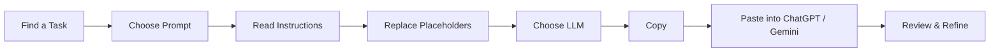

---

# 35. 404 Page

Route:

```text
/404
```

Example:

```text
404

Looks like this prompt doesn't exist.

[ Explore Prompts ]
```

Keep it lightweight.

---

# 36. Landing-to-Prompt UX

For a known task:

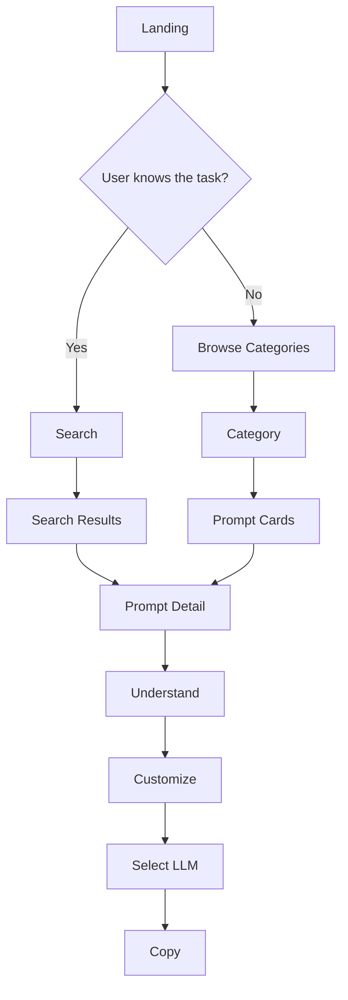

Target:

> **Known task → Prompt Detail in 1–2 interactions.**

---

# 37. Returning User Flow

For a returning user:

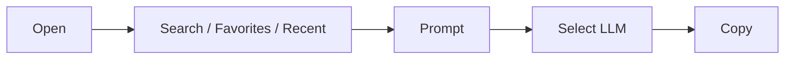

The system should become faster with familiarity rather than forcing users through the educational flow every time.

---

# 38. Navigation Depth

Avoid:

```text
Home → Explore → Category → Subcategory → Prompt
```

Prefer:

```text
Home → Search → Prompt
```

or:

```text
Home → Category → Prompt
```

Navigation depth should be treated as a UX constraint.

---

# 39. Visual Hierarchy

The application should establish this hierarchy:

### Level 1 — Task

> Draft Professional Email

### Level 2 — Understanding

> What it does / When to use

### Level 3 — Preparation

> Required information / Example

### Level 4 — Action

> ChatGPT / Gemini / Copy

The primary action should become visually stronger as the user progresses.

---

# 40. Animation & Transition System

Animations should support usability.

Recommended:

| Interaction | Duration |
|---|---:|
| Page transition | 200–250ms |
| Card hover | 150–200ms |
| Tab switch | 150–250ms |
| Copy feedback | 150–200ms |
| Favorite feedback | 150–250ms |

Use subtle:

- Fade.
- Translate.
- Scale.
- Border/background transitions.

Avoid:

- Constant animated backgrounds.
- Large hero animations.
- Long loading animations.
- Excessive glassmorphism effects.

Respect:

```css
prefers-reduced-motion
```

---

# 41. Design System

## Theme

Dark-first.

Conceptual palette:

```text
Background     → near-black / blue-black
Surface        → dark neutral
Surface Hover  → slightly lighter neutral
Primary        → warm orange/amber
Secondary      → restrained blue/cyan
Text           → off-white
Muted          → cool gray
Success        → green
Warning        → amber
Error          → red
```

The visual language may be AWS-inspired in spirit but must not imitate official AWS branding or imply official endorsement.

---

# 42. Typography

### Primary font

**Inter**

Use for:

- Headings
- Body
- Navigation
- Buttons
- Labels

### Prompt font

**JetBrains Mono**

Use for:

- Prompt text.
- Placeholder tokens.
- Technical snippets.

Avoid monospace for general UI text.

---

# 43. Iconography

Use one icon system consistently.

Recommended:

**Lucide React**

Potential icons:

- Search
- ArrowRight
- Star
- Mail
- Calendar
- Code
- Cloud
- Presentation
- Image
- Users
- Copy
- Check
- ChevronDown

Icons should communicate meaning, not merely decorate.

---

# 44. Component Architecture

Suggested high-level structure:

```text
src/
├── components/
│   ├── layout/
│   │   ├── Header
│   │   ├── Footer
│   │   └── PageContainer
│   │
│   ├── search/
│   │   ├── SearchBar
│   │   ├── SearchResults
│   │   └── SearchSuggestions
│   │
│   ├── prompts/
│   │   ├── PromptCard
│   │   ├── PromptGrid
│   │   ├── PromptHeader
│   │   ├── PromptInstructions
│   │   ├── PromptInputs
│   │   ├── PromptExample
│   │   ├── PromptViewer
│   │   ├── LLMSelector
│   │   └── CopyPromptButton
│   │
│   ├── categories/
│   │   ├── CategoryCard
│   │   └── CategoryGrid
│   │
│   └── common/
│       ├── Button
│       ├── Badge
│       ├── EmptyState
│       └── Tooltip
```

---

# 45. Page-to-Component Mapping

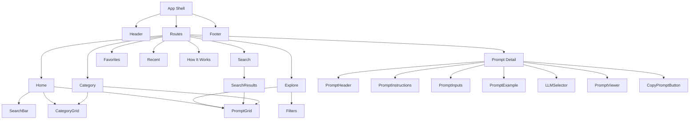

---

# 46. Data-to-UI Relationship

Prompt content must be data-driven.

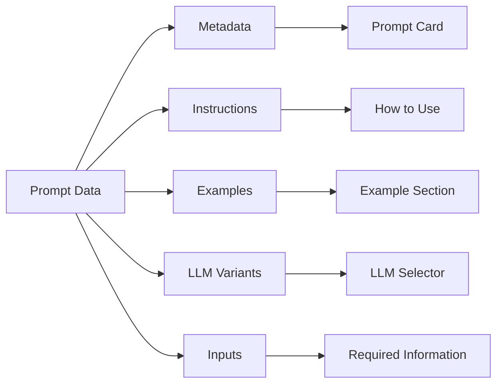

Adding a prompt should not require creating a new React page.

---

# 47. Content Authoring Rules

Every published prompt requires:

- Title
- Description
- Category
- Tags
- Instructions
- At least one example
- ChatGPT prompt
- Gemini prompt

Recommended metadata:

- Difficulty
- Featured flag
- Keywords
- Author
- Version
- Last updated

---

# 48. Prompt Quality Checklist

Before publishing:

- [ ] Purpose is immediately clear.
- [ ] Title describes the task.
- [ ] Required inputs are identified.
- [ ] Placeholders are understandable.
- [ ] Instructions are unambiguous.
- [ ] Model-specific prompt has been reviewed.
- [ ] Example uses realistic information.
- [ ] Example is clearly separated from reusable prompt.
- [ ] Output format is specified where appropriate.
- [ ] Prompt avoids unnecessary verbosity.
- [ ] Prompt avoids inventing information where appropriate.
- [ ] ChatGPT version has been reviewed.
- [ ] Gemini version has been reviewed.

---

# 49. Important UX Decision — Do Not Force Forms Too Early

The MVP should primarily provide:

> **Prompt + placeholders + instructions**

rather than forcing every prompt into a structured form.

Different prompts require different information.

Example:

```text
Coding:
{{CODE}}
{{ERROR}}
{{EXPECTED_BEHAVIOR}}
```

Creative:

```text
{{SUBJECT}}
{{STYLE}}
{{AUDIENCE}}
{{PLATFORM}}
```

A rigid form system could become restrictive.

A future "Fill & Copy" mode can add structured inputs where useful.

---

# 50. Future Fill & Copy Mode

Future interaction:

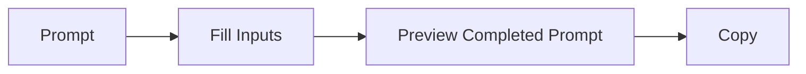

The MVP should keep manual placeholder replacement as the universal fallback.

---

# 51. MVP Screen Inventory

### Required

1. Landing / Home
2. Explore
3. Search Results
4. Category
5. Prompt Detail
6. Favorites
7. How It Works
8. 404

### Optional

9. Recently Viewed

There should be no separate ChatGPT or Gemini pages.

---

# 52. Accessibility

Required:

- Semantic HTML.
- Keyboard navigation.
- Visible focus states.
- Sufficient color contrast.
- Accessible button labels.
- Tooltips for unfamiliar icon-only controls.
- No functionality dependent solely on hover.
- Reduced-motion support.
- Proper heading hierarchy.

---

# 53. Performance

The application should be extremely lightweight.

Requirements:

- Client-side search.
- No unnecessary network requests.
- Optimized assets.
- Minimal dependency overhead.
- Fast initial load.
- No layout jank from animations.
- Good performance on average student devices and connections.

---

# 54. Privacy & Security

Because the MVP is static:

- No sensitive user information should be stored.
- No prompt content should be sent to a backend.
- No API keys should be included.
- No LLM credentials should be stored.
- No personal information should be collected.

Clipboard operations happen locally in the browser.

---

# 55. Deployment Architecture

Recommended:

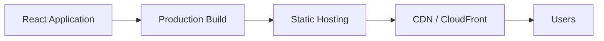

Possible static hosting:

- Amazon S3 + CloudFront
- Cloudflare Pages
- Vercel
- Netlify

S3 + CloudFront is a natural option for this AWS SBG project.

---

# 56. URL & Sharing Architecture

Prompts must have readable URLs:

```text
/prompt/draft-professional-email
/prompt/linkedin-post
/prompt/debug-code
/prompt/aws-architecture
```

Categories:

```text
/category/communication
/category/technical
/category/aws
```

A team member should be able to share a prompt URL directly with another member.

---

# 57. Prompt Governance Foundation

Even though the MVP is static, the data model should be ready for organizational governance.

Potential metadata:

```text
Author
Version
Last Updated
Status
```

Possible status values:

```text
draft
published
deprecated
```

No admin dashboard is required in MVP.

---

# 58. Future Extensibility

The architecture should allow:

### More LLMs

- Claude
- Microsoft Copilot
- Perplexity
- Open-source models

### Organization Workspaces

```text
AWS SBG
AWS Academy
Oracle Academy
Red Hat Academy
MHSSCE
```

### Administration

- Create prompts.
- Edit prompts.
- Publish prompts.
- Archive prompts.

### Analytics

- Most-used prompts.
- Most-used categories.
- Search queries.
- Copy frequency.

### AI Workflow Automation

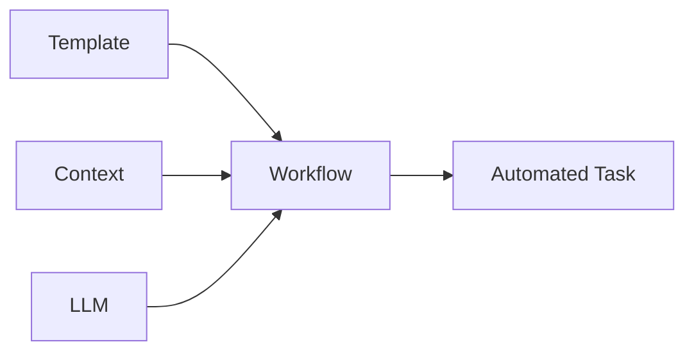

---

# 59. UX Success Metrics

Measure productivity rather than prompt count.

### Discovery time

Target:

> Common task → appropriate prompt in under 30 seconds.

### Prompt preparation time

Target:

> Common prompt → ready to copy in under 1–2 minutes.

### First-time usability

A new AWS SBG member should be able to use a prompt without external training.

### Repeat usage

Users should naturally return to prompts they frequently need.

---

# 60. Definition of a Good Prompt Page

A user should be able to answer these questions without leaving the page:

1. What does this prompt do?
2. Should I use it for my task?
3. What information do I need?
4. How do I customize it?
5. Should I use ChatGPT or Gemini?
6. What does a completed prompt look like?
7. How do I copy it?

If any answer requires another page, reconsider the UX.

---

# 61. Complete MVP User Journey

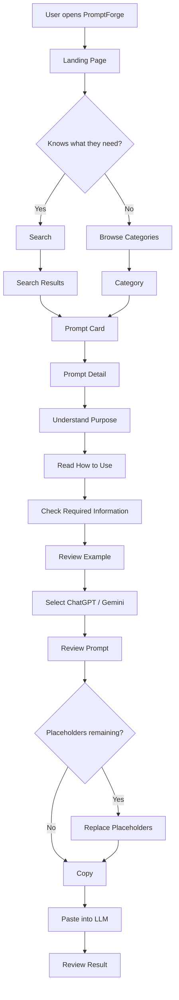

---

# 62. Final Architectural Principle

The entire application should optimize for one transition:

> **Intent → Prompt**

Everything else exists to make that transition:

- Faster
- Clearer
- More reliable
- More understandable
- More reusable

The ideal PromptForge experience is:

```text
"I need to create X."
        ↓
"Here is the prompt."
        ↓
"Here is how to use it."
        ↓
"Here is an example."
        ↓
"Choose your LLM."
        ↓
"Copy."
```

That is the core UX the MVP should be built around.
