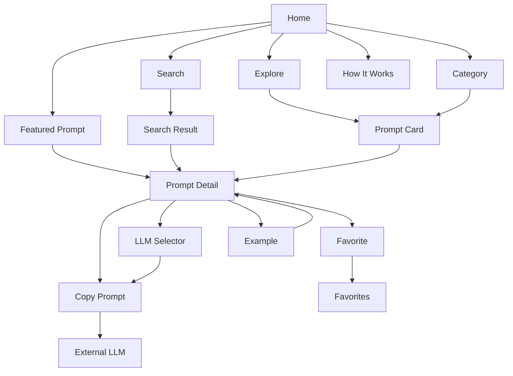
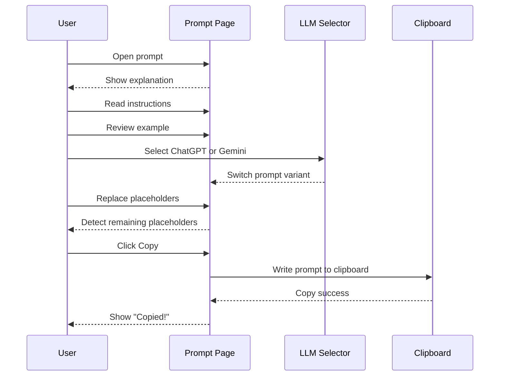
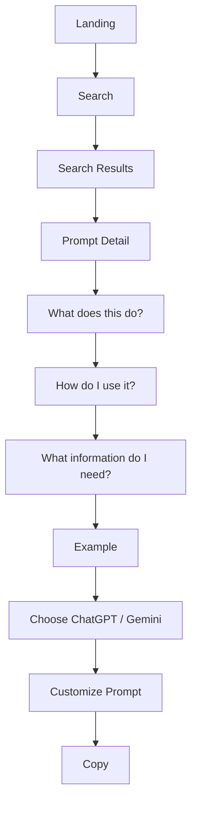
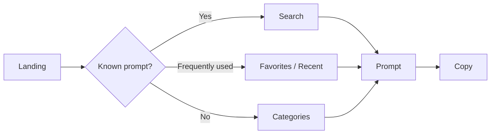
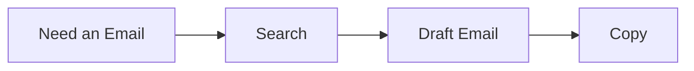
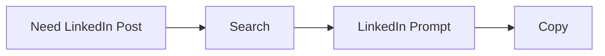
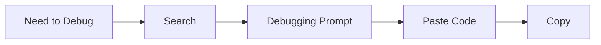
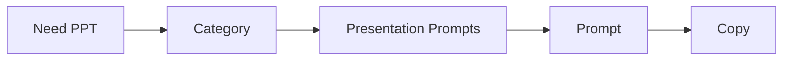
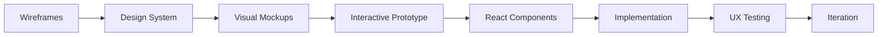

# PromptForge — AWS SBG

# Wireframes & Interaction Layout Specification

> **Purpose:** Define low-fidelity wireframes for every important PromptForge MVP screen before visual styling and React implementation.

---

## 1. Wireframing Philosophy

These wireframes intentionally avoid final colors, gradients, brand assets, detailed illustrations, and decorative animation.

They establish:

1. Information hierarchy.
2. Content density.
3. Navigation.
4. Interaction placement.
5. User flow.
6. Responsive behavior.

The core question is:

> **Where does every piece of information and every action live?**

---

## 2. Wireframe Legend

```text
┌───────────────┐
│ UI Container  │
└───────────────┘

[ Button ]

[ Input / Search ]

────── Divider ──────

→ Navigation / interaction

★ Important action

{{PLACEHOLDER}}
```

---

# 3. Global Desktop Shell

```text
┌──────────────────────────────────────────────────────────────────────┐
│ PromptForge     Explore    Categories    Favorites    Recent    🔍 │
├──────────────────────────────────────────────────────────────────────┤
│                                                                      │
│                         PAGE CONTENT                                 │
│                                                                      │
├──────────────────────────────────────────────────────────────────────┤
│ PromptForge                                      AWS SBG             │
│ Explore · Categories · How It Works                                  │
└──────────────────────────────────────────────────────────────────────┘
```

Rules:

- Header is persistent.
- Main content uses a maximum readable width.
- Footer follows page content.
- Prompt detail may use a sticky prompt workspace.
- Search remains accessible from every major page.

---

# 4. Global Mobile Shell

```text
┌───────────────────────────────┐
│ PromptForge          🔍   ☰  │
├───────────────────────────────┤
│                               │
│        PAGE CONTENT            │
│                               │
├───────────────────────────────┤
│ Home  Explore  Favorites  🔍 │
└───────────────────────────────┘
```

The bottom navigation is optional and should only be retained if testing shows it improves navigation.

---

# 5. Landing Page — Desktop

```text
┌──────────────────────────────────────────────────────────────────────┐
│ PromptForge     Explore    Categories    Favorites    Recent    🔍 │
├──────────────────────────────────────────────────────────────────────┤
│                                                                      │
│                           PROMPTFORGE                                │
│                                                                      │
│                  Your AI Prompt Toolkit                              │
│                           for AWS SBG                                 │
│                                                                      │
│      Reusable prompts for communication, content, events,            │
│              presentations, coding, AWS and more.                    │
│                                                                      │
│          ┌──────────────────────────────────────────┐                 │
│          │ 🔍  What do you want to do?              │                 │
│          └──────────────────────────────────────────┘                 │
│                                                                      │
│               [ Explore Prompts ]  [ How It Works ]                  │
│                                                                      │
├──────────────────────────────────────────────────────────────────────┤
│                         Explore by task                              │
│                                                                      │
│  ┌──────────────┐ ┌──────────────┐ ┌──────────────┐                 │
│  │ Communication│ │   Content    │ │    Events    │                 │
│  │ Emails       │ │ LinkedIn     │ │ Planning     │                 │
│  │ Letters      │ │ Social       │ │ Announcements│                 │
│  └──────────────┘ └──────────────┘ └──────────────┘                 │
│                                                                      │
│  ┌──────────────┐ ┌──────────────┐ ┌──────────────┐                 │
│  │ Presentations│ │  Creatives   │ │  Technical   │                 │
│  │ PPT / Slides │ │ Posters      │ │ Coding       │                 │
│  │               │ │ Images       │ │ Debugging    │                 │
│  └──────────────┘ └──────────────┘ └──────────────┘                 │
│                                                                      │
├──────────────────────────────────────────────────────────────────────┤
│                         Popular Prompts                              │
│                                                                      │
│  ┌────────────────┐ ┌────────────────┐ ┌────────────────┐           │
│  │ Prompt Card    │ │ Prompt Card    │ │ Prompt Card    │           │
│  │ Draft Email    │ │ LinkedIn Post  │ │ Debug Code     │           │
│  │ [ View → ]     │ │ [ View → ]     │ │ [ View → ]     │           │
│  └────────────────┘ └────────────────┘ └────────────────┘           │
│                                                                      │
├──────────────────────────────────────────────────────────────────────┤
│                          How It Works                                │
│                                                                      │
│          01                    02                    03              │
│        Find                  Customize               Copy            │
│     Find a prompt       Replace placeholders    Choose LLM & copy   │
│                                                                      │
├──────────────────────────────────────────────────────────────────────┤
│ PromptForge                                            AWS SBG       │
└──────────────────────────────────────────────────────────────────────┘
```

---

# 6. Landing Page — Mobile

```text
┌───────────────────────────────┐
│ PromptForge              ☰   │
├───────────────────────────────┤
│         PROMPTFORGE           │
│                               │
│   Your AI Prompt Toolkit      │
│          for AWS SBG          │
│                               │
│ ┌───────────────────────────┐ │
│ │ 🔍 What do you need?      │ │
│ └───────────────────────────┘ │
│                               │
│ [ Explore ]  [ How It Works ] │
│                               │
├───────────────────────────────┤
│ Explore by task               │
│                               │
│ ┌────────────┐ ┌────────────┐ │
│ │Communication│ │  Content   │ │
│ └────────────┘ └────────────┘ │
│ ┌────────────┐ ┌────────────┐ │
│ │   Events   │ │Presentations││
│ └────────────┘ └────────────┘ │
│ ┌────────────┐ ┌────────────┐ │
│ │ Creatives  │ │ Technical  │ │
│ └────────────┘ └────────────┘ │
│                               │
├───────────────────────────────┤
│ Popular Prompts               │
│ ┌───────────────────────────┐ │
│ │ Draft Professional Email  │ │
│ │ View →                    │ │
│ └───────────────────────────┘ │
│                               │
│ ┌───────────────────────────┐ │
│ │ Create LinkedIn Post      │ │
│ │ View →                    │ │
│ └───────────────────────────┘ │
│                               │
├───────────────────────────────┤
│ How It Works                  │
│ 01 Find  →  02 Customize     │
│  → 03 Copy                   │
└───────────────────────────────┘
```

---

# 7. Search Interaction

Search is one of the most important interactions.

```text
┌──────────────────────────────────────────────────────────────────────┐
│ PromptForge                                           [ × ]          │
├──────────────────────────────────────────────────────────────────────┤
│     ┌──────────────────────────────────────────────────────────┐     │
│     │ 🔍  linkedin                                             │     │
│     └──────────────────────────────────────────────────────────┘     │
│                                                                      │
│     Recent searches                                                 │
│     • email                                                         │
│     • event                                                         │
│                                                                      │
│     Suggested prompts                                               │
│                                                                      │
│     ✉  Create LinkedIn Post                               →        │
│     ✉  Event Announcement                                 →        │
│     ✉  Achievement LinkedIn Post                         →        │
└──────────────────────────────────────────────────────────────────────┘
```

Suggestions should appear while typing.

---

# 8. Search Results

```text
┌──────────────────────────────────────────────────────────────────────┐
│ Header                                                               │
├──────────────────────────────────────────────────────────────────────┤
│ Search prompts                                                       │
│                                                                      │
│ ┌──────────────────────────────────────────────────────────────┐     │
│ │ 🔍 linkedin                                                  │     │
│ └──────────────────────────────────────────────────────────────┘     │
│                                                                      │
│ 12 prompts found                                                    │
│                                                                      │
│ ┌──────────────────────────────────────────────────────────────┐     │
│ │ ★ Create LinkedIn Post                                      │     │
│ │ Create professional LinkedIn content for AWS SBG activities. │     │
│ │ Content · Social Media                                      │     │
│ │ ChatGPT · Gemini                             View Prompt →   │     │
│ └──────────────────────────────────────────────────────────────┘     │
│                                                                      │
│ ┌──────────────────────────────────────────────────────────────┐     │
│ │ Event LinkedIn Announcement                                  │     │
│ │ Create an announcement for an upcoming event.                │     │
│ │ Events · Social Media                        View Prompt →   │     │
│ └──────────────────────────────────────────────────────────────┘     │
└──────────────────────────────────────────────────────────────────────┘
```

---

# 9. Search — No Results

```text
┌──────────────────────────────────────────────────────────────────────┐
│ Search prompts                                                       │
│                                                                      │
│ ┌──────────────────────────────────────────────────────────────┐     │
│ │ 🔍 quantum spaceship                                        │     │
│ └──────────────────────────────────────────────────────────────┘     │
│                                                                      │
│                         No prompts found                            │
│                                                                      │
│              Try a different keyword or browse categories.          │
│                                                                      │
│                    [ Explore Categories ]                           │
└──────────────────────────────────────────────────────────────────────┘
```

Always provide a useful next action.

---

# 10. Explore Page

```text
┌──────────────────────────────────────────────────────────────────────┐
│ Header                                                               │
├──────────────────────────────────────────────────────────────────────┤
│ Explore Prompts                                                      │
│ Find a reusable prompt for your next task.                           │
│                                                                      │
│ ┌──────────────────────────────────────────────────────────────┐     │
│ │ 🔍 Search prompts                                            │     │
│ └──────────────────────────────────────────────────────────────┘     │
│                                                                      │
│ [ All ] [ Communication ] [ Content ] [ Events ] [ Technical ]      │
│ Sort: [ Recommended ▼ ]                                              │
│                                                                      │
│ 36 prompts                                                           │
│                                                                      │
│ ┌────────────────┐ ┌────────────────┐ ┌────────────────┐             │
│ │ Prompt Card    │ │ Prompt Card    │ │ Prompt Card    │             │
│ └────────────────┘ └────────────────┘ └────────────────┘             │
│ ┌────────────────┐ ┌────────────────┐ ┌────────────────┐             │
│ │ Prompt Card    │ │ Prompt Card    │ │ Prompt Card    │             │
│ └────────────────┘ └────────────────┘ └────────────────┘             │
└──────────────────────────────────────────────────────────────────────┘
```

---

# 11. Category Page

```text
┌──────────────────────────────────────────────────────────────────────┐
│ Header                                                               │
├──────────────────────────────────────────────────────────────────────┤
│ ← Explore                                                            │
│                                                                      │
│ Communication                                                        │
│ Create better organizational communication faster.                   │
│                                                                      │
│ ┌──────────────────────────────────────────────────────────────┐     │
│ │ 🔍 Search within Communication                              │     │
│ └──────────────────────────────────────────────────────────────┘     │
│                                                                      │
│ [ Emails ] [ Letters ] [ Announcements ] [ WhatsApp ]               │
│                                                                      │
│ ──────────────────────────────────────────────────────────────────   │
│ 12 prompts                                                           │
│                                                                      │
│ ┌────────────────┐ ┌────────────────┐ ┌────────────────┐             │
│ │ Prompt Card    │ │ Prompt Card    │ │ Prompt Card    │             │
│ └────────────────┘ └────────────────┘ └────────────────┘             │
└──────────────────────────────────────────────────────────────────────┘
```

---

# 12. Prompt Card

Reusable on Home, Explore, Category, Search, Favorites, and Recent.

```text
┌─────────────────────────────────────────────┐
│ Communication                         ☆     │
│                                             │
│ Draft Professional Email                    │
│                                             │
│ Write a clear and professional email        │
│ for organizational communication.           │
│                                             │
│ #email  #formal  #communication             │
│                                             │
│ ChatGPT  ·  Gemini                          │
│                                             │
│                              View Prompt →  │
└─────────────────────────────────────────────┘
```

Hierarchy:

```text
Category → Title → Description → Tags → LLM → Action
```

---

# 13. Prompt Detail — Desktop

The prompt detail page is the core product screen.

```text
┌──────────────────────────────────────────────────────────────────────┐
│ Header                                                               │
├──────────────────────────────────────────────────────────────────────┤
│ ← Communication                                      ☆ Favorite    │
│                                                                      │
│ Draft Professional Email                                             │
│ Create a clear, professional email for organizational communication. │
│ #email  #formal  #communication                                      │
│                                                                      │
├───────────────────────────────────┬──────────────────────────────────┤
│ ABOUT THIS PROMPT                 │ YOUR PROMPT                      │
│                                   │                                  │
│ What does it do?                 │ Use with                         │
│ Helps create professional         │ [ ChatGPT ] [ Gemini ]          │
│ organizational emails.            │                                  │
│                                   │ ┌──────────────────────────────┐ │
│ When should I use it?             │ │ You are an expert...         │ │
│ • Faculty communication           │ │                              │ │
│ • Event requests                  │ │ Recipient: {{RECIPIENT}}     │ │
│ • Announcements                   │ │ Purpose: {{PURPOSE}}         │ │
│                                   │ │ Tone: {{TONE}}               │ │
│ How to use                        │ │ ...                          │ │
│ 01 Gather information             │ └──────────────────────────────┘ │
│ 02 Replace placeholders           │                                  │
│ 03 Select your LLM                │ ⚠ 3 placeholders remain          │
│ 04 Copy the prompt                │                                  │
│                                   │          [ Copy Prompt ]         │
│ What you'll need                  │                                  │
│ [ Recipient ] [ Purpose ]         │                                  │
│ [ Context ]   [ Tone ]            │                                  │
│                                   │                                  │
│ Example                           │                                  │
│ Scenario                          │                                  │
│ Request permission for an AWS     │                                  │
│ workshop.                        │                                  │
│                                   │                                  │
│ [ View Example ]                  │                                  │
└───────────────────────────────────┴──────────────────────────────────┘
```

---

# 14. Prompt Detail — Sticky Workspace

Desktop recommendation:

```text
┌──────────────────────────┬─────────────────────────────┐
│ Scrolling content        │ Sticky prompt workspace     │
│                          │                             │
│ Overview                │ LLM selector                │
│ Instructions            │ Prompt                      │
│ Required information    │ Copy button                 │
│ Example                 │                             │
└──────────────────────────┴─────────────────────────────┘
```

The sticky area keeps the primary action available while the user reads.

---

# 15. Prompt Detail — Mobile

```text
┌───────────────────────────────┐
│ ← PromptForge            ☆   │
├───────────────────────────────┤
│ Communication                │
│                               │
│ Draft Professional Email     │
│                               │
│ Create a clear, professional │
│ email for communication.     │
│ #email #formal               │
├───────────────────────────────┤
│ What does it do?              │
│ Helps create professional     │
│ organizational emails.        │
├───────────────────────────────┤
│ When should I use it?         │
│ • Faculty communication       │
│ • Event requests              │
│ • Announcements               │
├───────────────────────────────┤
│ How to use                    │
│ 01 Gather information         │
│ 02 Replace placeholders       │
│ 03 Select LLM                 │
│ 04 Copy                       │
├───────────────────────────────┤
│ What you'll need              │
│ Recipient                     │
│ Purpose                       │
│ Context                       │
│ Tone                          │
├───────────────────────────────┤
│ Example                       │
│ [ View Example ]              │
├───────────────────────────────┤
│ Your Prompt                   │
│ [ ChatGPT ] [ Gemini ]        │
│                               │
│ ┌───────────────────────────┐ │
│ │ You are an expert...      │ │
│ │ {{RECIPIENT}}             │ │
│ │ {{PURPOSE}}               │ │
│ │ {{CONTEXT}}               │ │
│ └───────────────────────────┘ │
│                               │
│ ⚠ 3 placeholders remain      │
│                               │
│       [ Copy Prompt ]         │
└───────────────────────────────┘
```

---

# 16. LLM Selector

```text
Use with

┌──────────────┐ ┌──────────────┐
│ ✓ ChatGPT    │ │   Gemini     │
└──────────────┘ └──────────────┘
```

The interaction means:

> Same task, different prompt variant.

Switching must happen client-side without a page reload.

---

# 17. Prompt Viewer

```text
┌─────────────────────────────────────────────┐
│ You are an expert communication assistant. │
│                                             │
│ Draft a professional {{EMAIL_TYPE}} for    │
│ {{RECIPIENT}}.                              │
│                                             │
│ Context: {{CONTEXT}}                        │
│ Purpose: {{PURPOSE}}                        │
│ Tone: {{TONE}}                              │
│                                             │
│ Requirements:                               │
│ - {{REQUIREMENT_1}}                         │
│ - {{REQUIREMENT_2}}                         │
└─────────────────────────────────────────────┘
```

Final visual design should highlight placeholders clearly.

---

# 18. Copy Button States

Default:

```text
[ ⧉ Copy Prompt ]
```

Success:

```text
[ ✓ Copied! ]
```

Error:

```text
[ ⚠ Copy Failed ]
```

If clipboard access fails, provide a manual-copy fallback.

---

# 19. Placeholder Warning

```text
┌────────────────────────────────────────────┐
│ ⚠ 3 placeholders still need to be replaced │
│                                            │
│ {{RECIPIENT}}                              │
│ {{EVENT_NAME}}                             │
│ {{DATE}}                                   │
└────────────────────────────────────────────┘
```

This warning should inform, not block.

---

# 20. Example Section

Collapsed:

```text
┌─────────────────────────────────────────────┐
│ Example                                     │
│ See how this prompt can be used.            │
│ [ View Example → ]                          │
└─────────────────────────────────────────────┘
```

Expanded:

```text
┌─────────────────────────────────────────────┐
│ Example                              [ ↑ ] │
│                                             │
│ Scenario                                    │
│ Request permission for an AWS workshop.    │
│                                             │
│ Inputs                                      │
│ Recipient: Head of Department               │
│ Event: AWS Cloud Workshop                   │
│ Date: 15 September 2026                     │
│                                             │
│ Completed Prompt                            │
│ ┌─────────────────────────────────────────┐ │
│ │ You are an expert...                   │ │
│ │ ...                                     │ │
│ └─────────────────────────────────────────┘ │
│                                             │
│ Expected Result                             │
│ A professional permission request.          │
└─────────────────────────────────────────────┘
```

The reusable prompt and example must never look interchangeable.

---

# 21. Favorites Page

```text
┌──────────────────────────────────────────────────────────────────────┐
│ Header                                                               │
├──────────────────────────────────────────────────────────────────────┤
│ Your Favorites                                                       │
│ Prompts you've saved for quick access.                               │
│                                                                      │
│ ┌────────────────┐ ┌────────────────┐ ┌────────────────┐             │
│ │ ★ Prompt       │ │ ★ Prompt       │ │ ★ Prompt       │             │
│ │ View →         │ │ View →         │ │ View →         │             │
│ └────────────────┘ └────────────────┘ └────────────────┘             │
└──────────────────────────────────────────────────────────────────────┘
```

Favorites use localStorage in the MVP.

---

# 22. Favorites — Empty State

```text
┌──────────────────────────────────────────────────────────────────────┐
│                              ☆                                       │
│                       No favorites yet                               │
│                                                                      │
│          Save prompts you use frequently for faster access.          │
│                                                                      │
│                    [ Explore Prompts ]                               │
└──────────────────────────────────────────────────────────────────────┘
```

---

# 23. Recent Page

```text
┌──────────────────────────────────────────────────────────────────────┐
│ Header                                                               │
├──────────────────────────────────────────────────────────────────────┤
│ Recently Viewed                                                      │
│ Your last 10 prompt views.                                          │
│                                                                      │
│ ┌──────────────────────────────────────────────────────────────┐     │
│ │ Draft Professional Email                         Viewed now  │     │
│ │ Communication                                 View Prompt → │     │
│ └──────────────────────────────────────────────────────────────┘     │
│                                                                      │
│ ┌──────────────────────────────────────────────────────────────┐     │
│ │ Debug React Code                                10 min ago   │     │
│ │ Technical                                      View Prompt →│     │
│ └──────────────────────────────────────────────────────────────┘     │
└──────────────────────────────────────────────────────────────────────┘
```

Recent history should be limited to 10 prompts.

---

# 24. How It Works Page

```text
┌──────────────────────────────────────────────────────────────────────┐
│ Header                                                               │
├──────────────────────────────────────────────────────────────────────┤
│                     How PromptForge Works                            │
│                                                                      │
│           Find → Customize → Choose LLM → Copy → Use                │
│                                                                      │
│ 01 Find                                                              │
│ Search for the task you need to complete.                            │
│                                                                      │
│ 02 Understand                                                        │
│ Read what the prompt does and check the example.                     │
│                                                                      │
│ 03 Customize                                                         │
│ Replace the highlighted placeholders.                                │
│                                                                      │
│ 04 Choose your LLM                                                   │
│ Select ChatGPT or Gemini.                                            │
│                                                                      │
│ 05 Copy & Use                                                        │
│ Copy the prompt and paste it into your selected LLM.                 │
└──────────────────────────────────────────────────────────────────────┘
```

---

# 25. 404 Page

```text
┌──────────────────────────────────────────────────────────────────────┐
│ Header                                                               │
├──────────────────────────────────────────────────────────────────────┤
│                                                                      │
│                              404                                     │
│                                                                      │
│                  This prompt could not be found.                     │
│                                                                      │
│             It may have been moved or removed.                       │
│                                                                      │
│                       [ Explore Prompts ]                            │
│                                                                      │
└──────────────────────────────────────────────────────────────────────┘
```

---

# 26. Navigation Interaction Map



---

# 27. Complete Prompt Interaction



---

# 28. First-Time User Flow



The first-time experience is intentionally educational.

---

# 29. Returning User Flow



The returning experience should be substantially faster.

---

# 30. Responsive Behavior

## Desktop

```text
Two-column prompt page
3-column prompt grids
Persistent navigation
Sticky prompt workspace
```

## Tablet

```text
Two-column where possible
2-column prompt grids
Reduced navigation density
```

## Mobile

```text
Single-column content
1-column prompt cards
Collapsed navigation
Stacked prompt detail
Optional sticky copy action
```

---

# 31. Tablet Wireframe

```text
┌───────────────────────────────────────────────┐
│ PromptForge     Explore   Categories    ☰   │
├───────────────────────────────────────────────┤
│ Draft Professional Email                     │
│                                               │
├─────────────────────────┬─────────────────────┤
│ Explanation             │ Your Prompt         │
│                         │                     │
│ How to use              │ [ChatGPT] [Gemini] │
│                         │                     │
│ Required information    │ Prompt              │
│                         │                     │
│ Example                 │ [Copy Prompt]       │
└─────────────────────────┴─────────────────────┘
```

---

# 32. Loading State

Prompt cards:

```text
┌─────────────────────────────┐
│ ███████████████             │
│                             │
│ ████████████████████        │
│                             │
│ ███████████                 │
└─────────────────────────────┘
```

Prompt detail:

```text
██████████████████

████████████████████████████

┌────────────────────────────┐
│ ████████████████████████   │
│ ████████████████████████   │
│ ████████████████████████   │
└────────────────────────────┘
```

Skeleton loading should be subtle.

---

# 33. Error State

```text
┌──────────────────────────────────────────┐
│                                          │
│        Something went wrong.             │
│                                          │
│   We couldn't load this prompt.          │
│                                          │
│           [ Try Again ]                  │
│           [ Explore Prompts ]            │
│                                          │
└──────────────────────────────────────────┘
```

---

# 34. Keyboard Search

Desktop search may support:

```text
Ctrl / Cmd + K
```

Overlay:

```text
┌───────────────────────────────────────────────┐
│ 🔍 Search PromptForge...                     │
│                                               │
│ Type a task, category, or keyword.            │
│                                               │
│ ↑ ↓ Navigate   Enter Open   Esc Close        │
└───────────────────────────────────────────────┘
```

If implemented, the header can show:

```text
Search                         Ctrl K
```

---

# 35. Share Interaction

Future prompt header:

```text
Draft Professional Email

[ ☆ Favorite ] [ ↗ Share ]
```

Share menu:

```text
┌──────────────────────────────┐
│ Copy Link                    │
│ Share                        │
└──────────────────────────────┘
```

For MVP, clean shareable URLs are sufficient.

---

# 36. Information Density

Avoid making every section equally prominent.

Recommended rhythm:

```text
Large whitespace
       ↓
Primary heading
       ↓
Short description
       ↓
Primary interaction
       ↓
Content grouping
       ↓
Supporting information
```

The interface should breathe.

---

# 37. Content Priority

### Primary

Must be immediately visible.

### Secondary

Important but may appear below the fold.

### Supporting

Useful but should not compete with the main task.

For Prompt Detail:

```text
PRIMARY
- Prompt title
- LLM selector
- Prompt
- Copy

SECONDARY
- What it does
- How to use
- Required information

SUPPORTING
- Tags
- Example details
- Metadata
```

---

# 38. Above-the-Fold Requirements

## Landing

Must contain:

- Brand.
- Product purpose.
- Search.
- Primary CTA.

## Explore

Must contain:

- Page title.
- Search.
- Category filters.
- First prompt cards.

## Prompt Detail

Must contain:

- Prompt title.
- Short description.
- LLM selector.
- Beginning of prompt workspace.
- Clearly visible copy action.

---

# 39. Critical Interaction Paths









---

# 40. UX Anti-Patterns

Avoid:

### Prompt walls

```text
Home → 50 prompt cards → overwhelm
```

Use search and categories.

### Deep navigation

```text
Category → Subcategory → Type → Variant → Prompt
```

Avoid unnecessary levels.

### Raw prompt dumps

```text
Title
Prompt
Copy
```

Users need explanation and examples.

### Over-engineered forms

Do not turn every prompt into a 15-field form.

### Excessive animations

Motion should improve orientation, not distract.

### Too many CTAs

Each page should have one dominant action.

---

# 41. Wireframe Validation Checklist

Before visual design:

- [ ] Can a new user understand the product from the landing page?
- [ ] Is search immediately discoverable?
- [ ] Can a known task reach a prompt in 1–2 interactions?
- [ ] Can users understand a prompt without external help?
- [ ] Is the example clearly separated from the reusable prompt?
- [ ] Is ChatGPT/Gemini switching obvious?
- [ ] Is the copy action obvious?
- [ ] Are remaining placeholders detectable?
- [ ] Can users return to frequently used prompts quickly?
- [ ] Does mobile remain efficient?
- [ ] Is navigation depth reasonable?
- [ ] Are loading, error, and empty states defined?
- [ ] Are accessibility states represented?
- [ ] Does the interface avoid unnecessary complexity?

---

# 42. Wireframe-to-Design Transition



Do not jump directly from wireframes to implementation.

---

# 43. Final Wireframe Principle

Every screen should answer:

> **What is the user trying to accomplish right now?**

Then provide the shortest reasonable path to that outcome.

For PromptForge:

```text
                USER INTENT
                     │
                     ▼
                DISCOVERY
                     │
              ┌──────┴──────┐
              ▼             ▼
            SEARCH       CATEGORY
              │             │
              └──────┬──────┘
                     ▼
                  PROMPT
                     │
          ┌──────────┼──────────┐
          ▼          ▼          ▼
       UNDERSTAND  EXAMPLE   INSTRUCTIONS
          │          │          │
          └──────────┼──────────┘
                     ▼
                 CUSTOMIZE
                     │
                     ▼
               CHOOSE LLM
                     │
                     ▼
                   COPY
                     │
                     ▼
               EXTERNAL LLM
```

The wireframes should remain intentionally simple.

The sophistication of PromptForge should come from **information architecture, content quality, search relevance, interaction design, and visual polish** — not from unnecessary screens.
