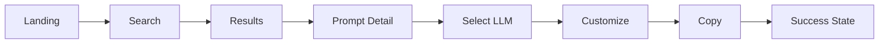

# PromptForge — AWS SBG
# Visual Prototype Specification

> Defines the visual direction and high-fidelity prototype behavior for the PromptForge MVP.

## 1. Visual Direction

PromptForge should feel like a **modern developer productivity tool**, not a generic AI website.

Core characteristics:

- Minimal
- Technical
- Premium
- Fast
- Dark-first
- Highly readable
- AWS-inspired without looking like an official AWS product
- Strong visual hierarchy
- Subtle motion
- Content-first

The UI should make finding and copying a prompt feel effortless.

## 2. Design Principles

### Clarity
Every screen should have one dominant purpose.

### Speed
Users should move from intent → prompt → copy with minimal friction.

### Familiarity
Use familiar patterns: search, cards, tabs, breadcrumbs, copy buttons, filters, favorites.

### Restraint
Avoid excessive gradients, large decorative illustrations, heavy glassmorphism, constant animations, and too many floating elements.

### Trust
Prompt content should feel curated and intentional.

## 3. Typography

Primary font: **Inter**

| Element | Weight | Purpose |
|---|---:|---|
| Display | 700–800 | Hero |
| H1 | 700 | Page titles |
| H2 | 650–700 | Sections |
| H3 | 600 | Cards |
| Body | 400–500 | Content |
| Label | 500–600 | UI |
| Code | Monospace | Prompt content |

Prompt text should use a highly readable monospace font or carefully selected technical font.

## 4. Color System

```text
Background:        #0B0F14
Surface:           #111820
Elevated Surface:  #161F29
Border:            #26313D
Primary Text:      #F5F7FA
Secondary Text:    #A7B0BB
Muted Text:        #6F7A86
Primary Accent:    #FF9900
```

The AWS-inspired orange accent should support the identity without making PromptForge look like an official AWS product.

## 5. Theme

MVP recommendation:

> **Dark-first implementation.**

Design the system so a future light theme can be introduced without restructuring components.

## 6. Layout System

Recommended maximum content width:

```text
1280px
```

Prompt detail:

```text
Explanation + Prompt workspace
```

Suggested desktop proportions:

```text
Explanation: 45%
Workspace:   55%
```

Spacing scale:

```text
4 / 8 / 12 / 16 / 24 / 32 / 48 / 64 / 96
```

## 7. Header

```text
┌─────────────────────────────────────────────────────────────────────┐
│ PromptForge   Explore   Categories   Favorites   Recent   Search   │
└─────────────────────────────────────────────────────────────────────┘
```

Behavior:

- Sticky
- Semi-transparent background
- Subtle bottom border
- Optional backdrop blur
- Brand on left
- Navigation near center/left
- Search shortcut on right

On scroll, increase surface contrast and border emphasis.

## 8. Hero

```text
                 PROMPTFORGE

          Your AI Prompt Toolkit
                 for AWS SBG

     Find. Customize. Copy. Get things done.

        ┌──────────────────────────────┐
        │ 🔍 Search prompts...         │
        └──────────────────────────────┘

             [ Explore Prompts ]
```

Use subtle background depth such as a radial gradient, soft grid, or faint technical lines. Decoration must never interfere with readability.

## 9. Prompt Cards

```text
┌───────────────────────────────────────┐
│ Communication                    ☆    │
│                                       │
│ Draft Professional Email              │
│                                       │
│ Create a professional email for...    │
│                                       │
│ #email #formal                        │
│                                       │
│ ChatGPT · Gemini        View Prompt → │
└───────────────────────────────────────┘
```

Interaction:

```text
Default → subtle border
Hover   → elevated + accent border
Focus   → visible focus ring
Active  → slight scale reduction
```

## 10. Prompt Detail

```text
┌─────────────────────────────────────────────────────────────────────┐
│ ← Communication                              ☆ Favorite             │
│                                                                     │
│ Draft Professional Email                                            │
│ Create a professional email for AWS SBG communication.              │
├───────────────────────────────┬─────────────────────────────────────┤
│ ABOUT                         │ PROMPT WORKSPACE                    │
│                               │                                     │
│ What it does                  │ Use with                            │
│ How to use                    │ [ ChatGPT ] [ Gemini ]              │
│ What you'll need              │                                     │
│ Example                       │ ┌─────────────────────────────────┐ │
│                               │ │ Prompt content                  │ │
│                               │ │ {{PLACEHOLDER}}                 │ │
│                               │ └─────────────────────────────────┘ │
│                               │ ⚠ 2 placeholders remain             │
│                               │ [ Copy Prompt ]                     │
└───────────────────────────────┴─────────────────────────────────────┘
```

The workspace should visually dominate because it contains the primary action.

## 11. Placeholder Styling

Example:

```text
Draft an email to {{RECIPIENT}}
regarding {{EVENT_NAME}}
on {{DATE}}.
```

Recommended treatment:

- Accent-tinted background
- Rounded inline container
- Stronger text
- Clear boundaries

## 12. Prompt Code Block

The prompt should resemble a premium developer editor:

- Monospace typography
- Line-height around 1.6
- Subtle surface contrast
- Rounded corners
- Optional line numbers for long prompts
- Placeholder highlighting
- Scrollable long content

## 13. LLM Selector

```text
┌───────────────┬───────────────┐
│ ✓ ChatGPT     │    Gemini     │
└───────────────┴───────────────┘
```

Switching should feel immediate and require no page reload.

## 14. Primary Button

```text
[ ⧉ Copy Prompt ]
```

Success:

```text
[ ✓ Copied! ]
```

The success state should persist briefly before returning to default.

## 15. Search

```text
┌───────────────────────────────────────────────┐
│ 🔍  Search prompts...                    ⌘ K │
└───────────────────────────────────────────────┘
```

Focus state:

- Accent border
- Soft glow
- Elevated surface

## 16. Filters

```text
[ All ] [ Communication ] [ Content ] [ Events ] [ Technical ] [ Creative ]
```

Selected:

```text
[ ✓ Communication ]
```

Avoid excessive filter controls.

## 17. Favorite Interaction

Default:

```text
☆
```

Saved:

```text
★
```

Animation should be brief, approximately under 250ms.

## 18. Motion System

Motion should communicate navigation, state changes, focus, hierarchy, and feedback.

Suggested durations:

```text
Micro:     120–180ms
Standard:  200–300ms
Page:      300–450ms
```

## 19. Page Transitions

Recommended:

```text
opacity: 0 → 1
translateY(4px) → 0
```

Avoid dramatic page animations.

## 20. Hover Behavior

Prompt card:

```text
translateY(-2px)
border emphasis
shadow increase
```

Button:

```text
slightly brighter
```

Navigation:

```text
text emphasis
```

## 21. Loading States

Use skeleton loaders that mimic the final layout. Avoid full-screen spinners unless necessary.

## 22. Empty States

```text
             ☆

        No favorites yet

Save prompts you frequently use
for faster access.

       [ Explore Prompts ]
```

## 23. Responsive Visual Design

### Desktop
- Full navigation
- 3-column card grid
- Two-column prompt detail

### Tablet
- Compact navigation
- 2-column cards
- Two-column detail where practical

### Mobile
- Single-column cards
- Stacked prompt detail
- Compact header
- Large touch targets
- Copy action easy to reach

## 24. Accessibility

Minimum requirements:

- Keyboard navigation
- Visible focus states
- Sufficient contrast
- Reduced-motion support
- Accessible button labels
- Screen-reader-friendly icons
- Touch targets around 44px or larger

Respect:

```css
@media (prefers-reduced-motion: reduce)
```

## 25. Visual Prototype Screens

The first high-fidelity prototype should cover:

1. Landing
2. Search overlay
3. Search results
4. Explore
5. Category
6. Prompt detail — ChatGPT
7. Prompt detail — Gemini
8. Prompt detail — copied state
9. Favorites
10. Recent
11. How It Works
12. Empty state
13. Error state
14. Mobile landing
15. Mobile prompt detail

## 26. Prototype Flow



## 27. Visual Quality Gate

- [ ] Brand is recognizable.
- [ ] Search is visually dominant.
- [ ] Prompt cards are scannable.
- [ ] Prompt detail is easy to understand.
- [ ] Copy action is unmistakable.
- [ ] ChatGPT/Gemini switching is obvious.
- [ ] Placeholder styling is clear.
- [ ] Examples do not compete with the prompt.
- [ ] Typography is consistent.
- [ ] Spacing is consistent.
- [ ] Mobile remains usable.
- [ ] Animations are purposeful.
- [ ] Accessibility states exist.

## 28. Final Visual Principle

PromptForge should look like a tool that users **trust to get work done quickly**.

```text
Professional + Technical + Fast + Curated + Simple
```
