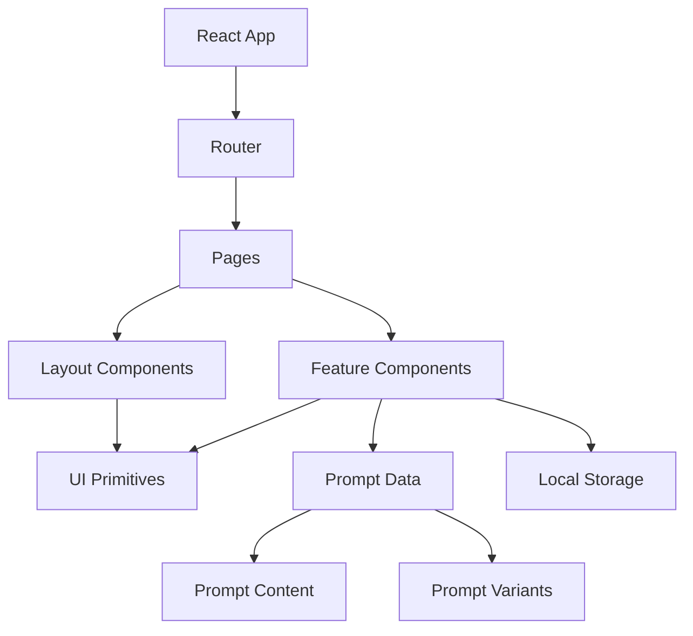
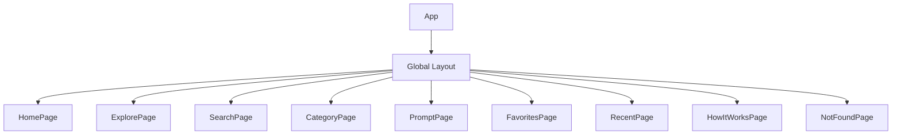
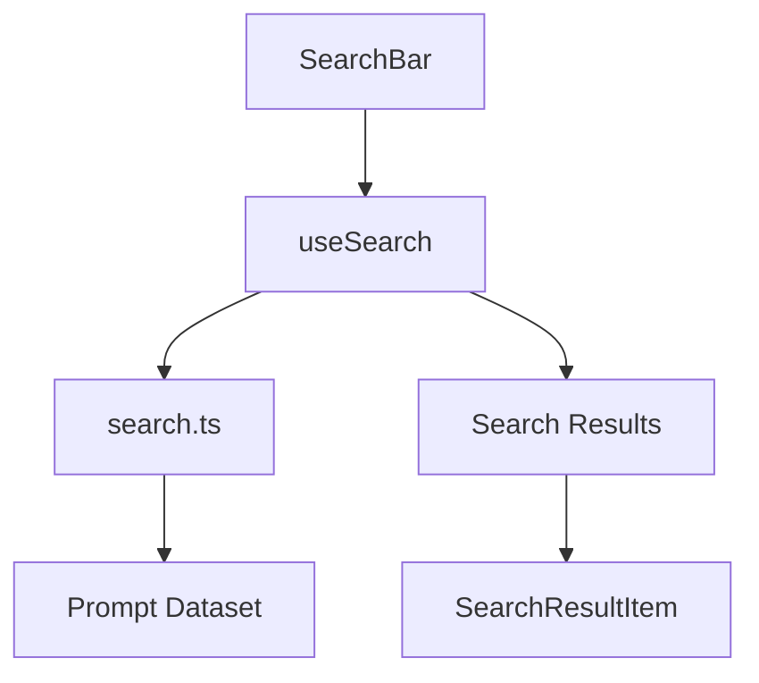
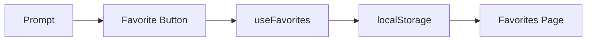
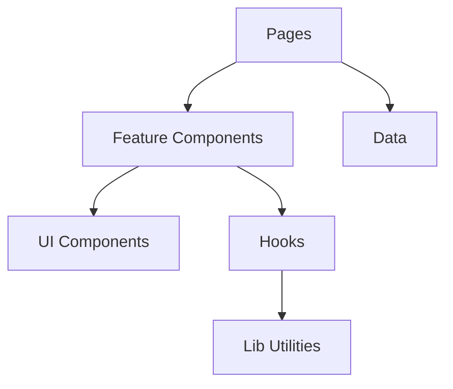

# PromptForge — AWS SBG

# Component Architecture

> Defines the React component structure, responsibilities, composition strategy, and data boundaries for the MVP.

## 1. Architecture Goals

- Low coupling
- High cohesion
- Reusable UI primitives
- Clear page boundaries
- Easy prompt-content updates
- Responsive behavior
- Accessible interactions
- Minimal unnecessary state
- Future support for additional organizations

The MVP remains a **static React application**.

## 2. Architectural Overview



## 3. Recommended Source Structure

```text
src/
├── app/
│   ├── App.tsx
│   ├── router.tsx
│   └── providers.tsx
├── assets/
│   ├── images/
│   └── icons/
├── components/
│   ├── common/
│   │   ├── Button.tsx
│   │   ├── Badge.tsx
│   │   ├── Card.tsx
│   │   ├── EmptyState.tsx
│   │   ├── ErrorState.tsx
│   │   ├── Loading.tsx
│   │   └── Tooltip.tsx
│   ├── layout/
│   │   ├── Header.tsx
│   │   ├── Footer.tsx
│   │   ├── MobileNav.tsx
│   │   └── PageContainer.tsx
│   ├── search/
│   │   ├── SearchBar.tsx
│   │   ├── SearchOverlay.tsx
│   │   ├── SearchResults.tsx
│   │   └── SearchResultItem.tsx
│   ├── prompts/
│   │   ├── PromptCard.tsx
│   │   ├── PromptGrid.tsx
│   │   ├── PromptHeader.tsx
│   │   ├── PromptContent.tsx
│   │   ├── PromptWorkspace.tsx
│   │   ├── PromptViewer.tsx
│   │   ├── PlaceholderHighlight.tsx
│   │   ├── LLMSelector.tsx
│   │   ├── CopyPromptButton.tsx
│   │   ├── PlaceholderWarning.tsx
│   │   ├── PromptInstructions.tsx
│   │   ├── PromptRequirements.tsx
│   │   └── PromptExample.tsx
│   ├── categories/
│   │   ├── CategoryCard.tsx
│   │   ├── CategoryFilter.tsx
│   │   └── CategoryHeader.tsx
│   └── feedback/
│       ├── Toast.tsx
│       └── CopyFeedback.tsx
├── pages/
│   ├── HomePage.tsx
│   ├── ExplorePage.tsx
│   ├── SearchPage.tsx
│   ├── CategoryPage.tsx
│   ├── PromptPage.tsx
│   ├── FavoritesPage.tsx
│   ├── RecentPage.tsx
│   ├── HowItWorksPage.tsx
│   └── NotFoundPage.tsx
├── data/
│   ├── prompts/
│   │   ├── communication.ts
│   │   ├── content.ts
│   │   ├── events.ts
│   │   ├── presentations.ts
│   │   ├── creatives.ts
│   │   └── technical.ts
│   ├── categories.ts
│   └── index.ts
├── hooks/
│   ├── useSearch.ts
│   ├── useFavorites.ts
│   ├── useRecent.ts
│   ├── useClipboard.ts
│   └── useMediaQuery.ts
├── lib/
│   ├── search.ts
│   ├── storage.ts
│   ├── prompts.ts
│   └── utils.ts
├── types/
│   ├── prompt.ts
│   ├── category.ts
│   └── navigation.ts
└── styles/
    ├── globals.css
    └── tokens.css
```

## 4. Page Architecture



Pages should primarily compose components rather than contain large amounts of UI logic.

## 5. Global Layout

### Header

Owns:

- Brand
- Main navigation
- Search trigger
- Mobile menu
- Current navigation state

Does not own search logic, prompt filtering, or favorite state.

### Footer

Owns product identity, organization identity, navigation, and attribution.

## 6. Search Architecture



### SearchBar

Input, keyboard shortcut, focus state, and submission.

### SearchOverlay

Overlay presentation, recent searches, suggestions, and keyboard navigation.

### SearchResultItem

Prompt title, category, description, supported LLMs, and navigation.

## 7. Prompt Architecture

```tsx
<PromptPage>
  <PromptHeader />
  <PromptInstructions />
  <PromptRequirements />
  <PromptExample />
  <PromptWorkspace>
    <LLMSelector />
    <PromptViewer />
    <PlaceholderWarning />
    <CopyPromptButton />
  </PromptWorkspace>
</PromptPage>
```

## 8. Prompt Workspace

Owns:

- Current LLM
- Current prompt variant
- Placeholder detection
- Copy interaction

Does not own global navigation, search, favorites, or the prompt database.

## 9. LLM Selector

```tsx
<LLMSelector value={selectedLLM} onChange={setSelectedLLM} />
```

MVP:

```ts
type LLM = "chatgpt" | "gemini";
```

Future values can include Claude, Perplexity, Grok, or Copilot without changing the basic component contract.

## 10. Prompt Viewer

```tsx
<PromptViewer prompt={promptText} />
```

Responsibilities:

- Display selected prompt variant
- Highlight placeholders
- Preserve formatting
- Allow scrolling
- Support copy

## 11. Placeholder Detection

Suggested syntax:

```text
{{PLACEHOLDER}}
```

Central utilities:

```ts
extractPlaceholders(prompt);
hasUnfilledPlaceholders(prompt);
```

Example result:

```ts
["RECIPIENT", "EVENT_NAME"];
```

## 12. Copy Prompt Button

Responsibilities:

1. Receive final prompt text.
2. Write it to clipboard.
3. Display success/failure state.
4. Return to default state.

```tsx
<CopyPromptButton prompt={promptText} />
```

Use `useClipboard`.

## 13. Favorites



Store prompt IDs rather than complete prompt objects.

## 14. Recent Prompts

Store only prompt IDs.

Recommended maximum:

```text
10
```

Opening a prompt updates the recent list.

## 15. Data Model

```ts
export interface Prompt {
  id: string;
  title: string;
  description: string;
  categoryId: string;
  tags: string[];
  supportedLLMs: LLM[];
  instructions: string[];
  requirements: string[];
  variants: {
    chatgpt?: string;
    gemini?: string;
  };
  example?: {
    scenario: string;
    inputs: Record<string, string>;
    completedPrompt: string;
    expectedResult?: string;
  };
}
```

## 16. Category Model

```ts
export interface Category {
  id: string;
  name: string;
  description: string;
  icon?: string;
}
```

## 17. Prompt IDs

Use stable URL-safe IDs:

```text
draft-professional-email
linkedin-event-post
debug-react-code
plan-aws-architecture
```

Avoid numeric-only IDs.

## 18. URL Architecture

```text
/
/explore
/search?q=
/category/:categoryId
/prompt/:promptId
/favorites
/recent
/how-it-works
```

Example:

```text
/prompt/draft-professional-email
```

## 19. Component Dependency Direction



Avoid UI components depending directly on page-specific business logic.

## 20. State Ownership

| State          | Owner                       |
| -------------- | --------------------------- |
| Search query   | Search                      |
| Selected LLM   | Prompt Workspace            |
| Copy status    | Copy Button                 |
| Favorites      | useFavorites                |
| Recent prompts | useRecent                   |
| Mobile menu    | Header                      |
| Prompt data    | Static dataset              |
| Theme          | Global CSS / future context |

Prefer local state unless state genuinely needs to be shared.

## 21. Global State

Do not introduce Zustand or Redux solely for the MVP.

React state + hooks + localStorage are sufficient.

## 22. Styling Architecture

Recommended:

```text
Tailwind CSS
+
CSS variables for design tokens
```

Keep visual tokens centralized.

## 23. Animation Architecture

Use CSS transitions for simple interactions.

Reusable animation components should only be introduced where they provide genuine value.

## 24. Accessibility Architecture

Reusable components should handle:

- Keyboard focus
- `aria-label`
- `aria-expanded`
- `aria-selected`
- Semantic buttons
- Reduced motion

## 25. Component Naming

Good:

```text
PromptCard
PromptViewer
CopyPromptButton
SearchOverlay
CategoryFilter
```

Avoid:

```text
Box
Thing
PromptStuff
MainComponent
```

## 26. Component Rules

Each component should have one primary responsibility.

If a component becomes responsible for data fetching, filtering, navigation, animation, rendering, and storage simultaneously, split it.

## 27. Feature Boundaries

Prompt functionality:

```text
components/prompts/
```

Search:

```text
components/search/
```

Avoid a single massive component such as:

```text
components/PromptSystem.tsx
```

## 28. Testing Strategy

### Unit tests

- Placeholder extraction
- Search matching
- Favorites persistence
- Recent persistence
- Prompt variant selection

### Component tests

- Copy button
- LLM selector
- Search
- Prompt card

### Manual UX

- Mobile
- Keyboard navigation
- Copy flow
- Search flow
- Empty states

## 29. Performance

Because the app is static:

- Keep prompt data local.
- Lazy-load non-critical pages where useful.
- Avoid unnecessary libraries.
- Optimize assets.
- Avoid large animation libraries for simple effects.

## 30. Future Organization Support

MVP:

```text
AWS SBG
```

Future:

```text
AWS SBG
AWS Academy
Red Hat Academy
Oracle Academy
MHSSCE
```

A future data model can include:

```ts
organizationId: string;
```

Do not implement multi-organization UI until required.

## 31. Architecture Quality Gate

- [ ] Pages are thin composition layers.
- [ ] Prompt data is separated from UI.
- [ ] Search logic is reusable.
- [ ] Clipboard logic is isolated.
- [ ] Favorites use stable IDs.
- [ ] Recent history uses stable IDs.
- [ ] LLM switching is reusable.
- [ ] Placeholder parsing has one utility.
- [ ] UI primitives are reusable.
- [ ] No unnecessary global state.
- [ ] Components are responsive.
- [ ] Accessibility is built into primitives.

## 32. Architecture Principle

```text
Content
  ↓
Data
  ↓
Feature Logic
  ↓
Components
  ↓
Pages
  ↓
Router
```

The architecture should make it easy to add **100 new prompts without creating 100 new React components**.
