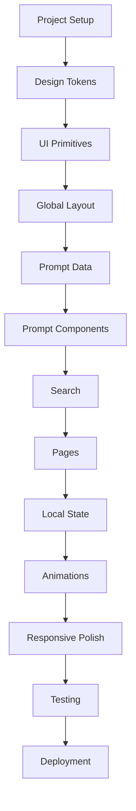
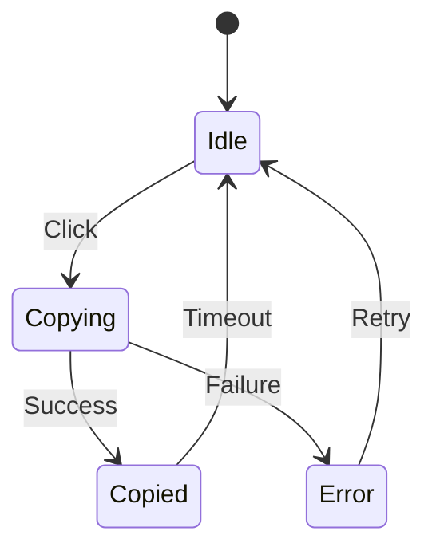
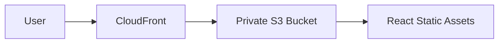
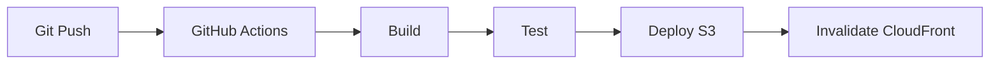
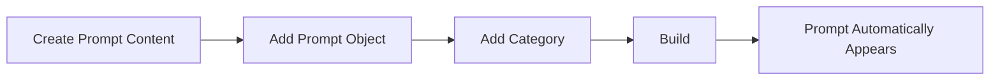
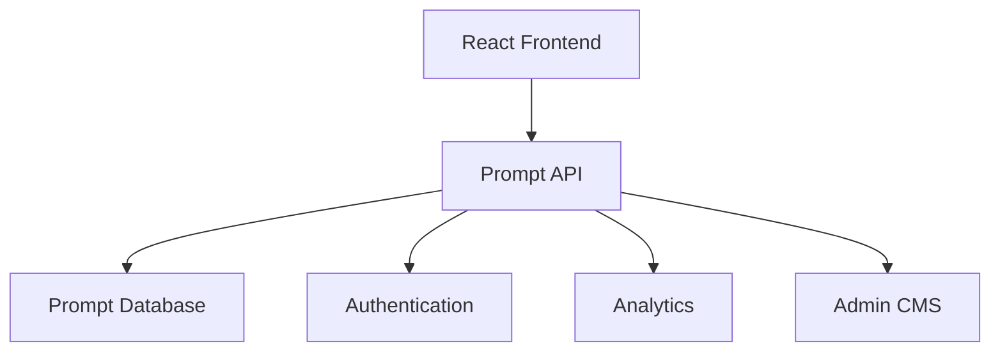

# PromptForge — AWS SBG

# Code & Implementation Plan

> Defines the implementation strategy for the React MVP after requirements, page architecture, and wireframes.

## 1. Technology Stack

### Core

- React
- TypeScript
- Vite
- React Router

### Styling

- Tailwind CSS
- CSS custom properties for design tokens

### Icons

- Lucide React or another lightweight icon library

### State

- React state
- Custom hooks
- localStorage

### Deployment

Recommended:

- Amazon S3 + CloudFront
- GitHub Pages
- Vercel
- Netlify

For an AWS-focused project, **S3 + CloudFront** is a natural deployment target.

## 2. Development Principles

```text
Correctness
   ↓
Maintainability
   ↓
UX
   ↓
Performance
   ↓
Visual polish
```

Do not optimize prematurely.

## 3. Project Initialization

```bash
npm create vite@latest promptforge -- --template react-ts
cd promptforge
npm install
npm install react-router-dom
npm install lucide-react
```

Install Tailwind according to the current Tailwind/Vite setup.

## 4. Initial Directory

```text
promptforge/
├── public/
├── src/
│   ├── app/
│   ├── assets/
│   ├── components/
│   ├── data/
│   ├── hooks/
│   ├── lib/
│   ├── pages/
│   ├── types/
│   └── styles/
├── index.html
├── package.json
├── tsconfig.json
├── vite.config.ts
└── README.md
```

## 5. Implementation Order



## 6. Phase 1 — Project Setup

Create:

```text
App
Router
Global CSS
Tailwind
TypeScript configuration
```

Verify:

```bash
npm run dev
npm run build
```

Both must work before feature development.

## 7. Phase 2 — Design Tokens

Create:

```text
src/styles/tokens.css
```

Define:

- Colors
- Typography
- Spacing
- Radius
- Shadows
- Transitions
- Z-index levels

Example:

```css
:root {
  --color-bg: #0b0f14;
  --color-surface: #111820;
  --color-border: #26313d;
  --color-text: #f5f7fa;
  --color-muted: #a7b0bb;
  --color-accent: #ff9900;
}
```

Do not scatter raw design values throughout components.

## 8. Phase 3 — UI Primitives

Build:

```text
Button
Badge
Card
IconButton
Input
Tabs
Tooltip
```

## 9. Phase 4 — Layout

Build:

```text
Header
Footer
MobileNav
PageContainer
```

Verify desktop, tablet, mobile, and keyboard navigation.

## 10. Phase 5 — Prompt Data

Create the initial dataset.

```ts
export const prompts: Prompt[] = [
  {
    id: "draft-professional-email",
    title: "Draft Professional Email",
    description: "Create a clear and professional organizational email.",
    categoryId: "communication",
    tags: ["email", "formal", "communication"],
    supportedLLMs: ["chatgpt", "gemini"],
    instructions: [
      "Gather the required information.",
      "Replace every placeholder.",
      "Select your preferred LLM.",
      "Copy the completed prompt.",
    ],
    requirements: ["Recipient", "Purpose", "Context", "Tone"],
    variants: {
      chatgpt: "...",
      gemini: "...",
    },
  },
];
```

Keep prompt content outside components.

## 11. Prompt Content Rules

Every prompt should have:

```text
Unique ID
Title
Description
Category
Tags
Supported LLMs
Instructions
Requirements
LLM-specific variants
Optional example
```

## 12. Phase 6 — Prompt Components

Implement:

```text
PromptCard
PromptGrid
PromptHeader
LLMSelector
PromptViewer
PlaceholderHighlight
PlaceholderWarning
CopyPromptButton
PromptInstructions
PromptRequirements
PromptExample
PromptWorkspace
```

Build and test components independently.

## 13. Placeholder Parsing

Implement:

```ts
export function extractPlaceholders(text: string): string[] {
  // Match {{PLACEHOLDER}}
}

export function hasUnfilledPlaceholders(text: string): boolean {
  // Detect remaining placeholders
}
```

Keep parsing logic in:

```text
src/lib/prompts.ts
```

## 14. Copy Logic

Create:

```text
src/hooks/useClipboard.ts
```

Suggested API:

```ts
const { copied, copy, error } = useClipboard();
```

Behavior:



## 15. LLM Variant Logic

Prompt data:

```ts
variants: {
  chatgpt: "...",
  gemini: "..."
}
```

Workspace:

```ts
const [selectedLLM, setSelectedLLM] = useState<LLM>("chatgpt");
```

Display the selected variant without a page reload.

## 16. Phase 7 — Search

Create:

```text
useSearch
search.ts
SearchBar
SearchOverlay
SearchResults
SearchResultItem
```

Search fields:

```text
Title
Description
Category
Tags
```

Initial search can use normalized substring matching.

## 17. Search Ranking

Initial ranking:

```text
Exact title match
      ↓
Title contains query
      ↓
Tag match
      ↓
Category match
      ↓
Description match
```

Later, evolve into a relevance score if needed.

## 18. Phase 8 — Pages

Build:

```text
HomePage
ExplorePage
PromptPage
CategoryPage
SearchPage
FavoritesPage
RecentPage
HowItWorksPage
NotFoundPage
```

Build PromptPage early because it validates the central product experience.

## 19. Router

```tsx
<Routes>
  <Route path="/" element={<HomePage />} />
  <Route path="/explore" element={<ExplorePage />} />
  <Route path="/search" element={<SearchPage />} />
  <Route path="/category/:categoryId" element={<CategoryPage />} />
  <Route path="/prompt/:promptId" element={<PromptPage />} />
  <Route path="/favorites" element={<FavoritesPage />} />
  <Route path="/recent" element={<RecentPage />} />
  <Route path="/how-it-works" element={<HowItWorksPage />} />
  <Route path="*" element={<NotFoundPage />} />
</Routes>
```

## 20. Phase 9 — Favorites

Create:

```text
useFavorites.ts
storage.ts
```

Storage key:

```text
promptforge:favorites
```

Store prompt IDs only:

```json
["prompt-id-1", "prompt-id-2"]
```

## 21. Phase 10 — Recent

Storage key:

```text
promptforge:recent
```

Algorithm:

```text
Open prompt
    ↓
Remove existing ID
    ↓
Add ID to front
    ↓
Limit to 10
    ↓
Persist
```

## 22. Phase 11 — Animations

Start with CSS transitions.

Implement:

- Card hover
- Button hover
- Favorite animation
- Copy success
- Search overlay
- Page entrance
- Mobile navigation

Only add an animation library if real requirements justify it.

## 23. Phase 12 — Responsive Implementation

Test:

```text
320px
375px
430px
768px
1024px
1280px
1440px
```

Check:

- Header
- Search
- Cards
- Prompt workspace
- Copy button
- Long prompt content
- Example sections

## 24. Keyboard Support

Implement:

```text
Tab
Shift + Tab
Enter
Space
Escape
Arrow Up
Arrow Down
Ctrl/Cmd + K
```

Search overlay should support keyboard navigation.

## 25. URL Behavior

Prompt URLs must be directly accessible.

Example:

```text
/prompt/draft-professional-email
```

For S3/CloudFront, configure SPA fallback appropriately.

## 26. Error Handling

Handle:

- Invalid prompt ID
- Missing category
- Clipboard failure
- Empty search
- Unknown route
- Missing prompt variant

Do not silently fail.

## 27. Performance Rules

Avoid:

```text
Huge dependencies
Unoptimized images
Unnecessary rerenders
Global state for local concerns
Large animation bundles
```

Prefer:

```text
Static data
Code splitting where useful
CSS transitions
Small components
Memoization only when profiling supports it
```

## 28. SEO / Metadata

Each prompt page should have useful metadata where practical.

Example:

```text
Title:
Draft Professional Email | PromptForge

Description:
Reusable AI prompt for creating professional AWS SBG emails.
```

Shareability matters even though SEO is not the primary MVP objective.

## 29. Analytics

Do not add analytics automatically.

If later required, useful events include:

```text
prompt_view
prompt_copy
prompt_favorite
search
llm_switch
example_open
```

## 30. Security

The MVP has no backend and should not collect sensitive prompt inputs.

Do not:

- Store sensitive user-entered information unnecessarily.
- Put secrets in frontend code.
- Add ChatGPT/Gemini API keys.
- Pretend to directly integrate with LLMs.

PromptForge only prepares prompts.

## 31. Deployment

Recommended AWS architecture:



Use:

- S3 for static assets
- CloudFront for delivery
- HTTPS
- Private S3 bucket with CloudFront access

Static hosting on S3 does not need to be enabled if CloudFront is configured correctly.

## 32. CI/CD — Future



Do not make CI/CD a blocker for the first local prototype.

## 33. Testing Checklist

### Functional

- [ ] Routes work.
- [ ] Search works.
- [ ] Prompt pages work.
- [ ] LLM switching works.
- [ ] Placeholder detection works.
- [ ] Copy works.
- [ ] Favorites persist.
- [ ] Recent prompts persist.
- [ ] Invalid routes show 404.

### UX

- [ ] User can discover prompts quickly.
- [ ] Search is obvious.
- [ ] Prompt explanation is understandable.
- [ ] Example is easy to find.
- [ ] Copy action is obvious.
- [ ] Mobile workflow is efficient.

### Accessibility

- [ ] Keyboard navigation.
- [ ] Focus states.
- [ ] Contrast.
- [ ] ARIA where necessary.
- [ ] Reduced motion.

## 34. Build Validation

Before each major milestone:

```bash
npm run build
```

A feature is not complete if development mode works but production build fails.

## 35. Git Strategy

Suggested branches:

```text
main
develop
feature/ui-system
feature/prompts
feature/search
feature/favorites
feature/responsive
```

Commit examples:

```text
feat: add prompt detail workspace
feat: implement prompt search
feat: add favorites persistence
fix: handle clipboard failure
style: refine prompt card hover states
```

## 36. Code Quality Rules

Prefer:

```ts
const prompt = getPromptById(id);
```

and:

```tsx
<PromptCard prompt={prompt} />
```

Avoid embedding prompt data directly in JSX or duplicating markup.

## 37. Avoid Premature Abstraction

Abstract when:

```text
The behavior is genuinely shared
AND
The abstraction improves maintainability
```

Do not create generic abstractions merely because two components currently look similar.

## 38. Content-to-Code Workflow



Adding a prompt should not require modifying router, PromptPage, Search, Explore, or Category components.

## 39. Example Prompt Addition

A developer should only need to add:

```ts
{
  id: "aws-event-announcement",
  title: "AWS Event Announcement",
  description: "...",
  categoryId: "events",
  tags: ["aws", "event", "announcement"],
  supportedLLMs: ["chatgpt", "gemini"],
  instructions: [...],
  requirements: [...],
  variants: {
    chatgpt: "...",
    gemini: "..."
  },
  example: {...}
}
```

The rest of the application should discover it automatically.

## 40. Future Backend Boundary

MVP:

```text
Human
  ↓
PromptForge
  ↓
Copy
  ↓
External LLM
```

Future:



Potential future capabilities:

- Authentication
- Team-specific prompts
- Admin management
- Versioning
- Prompt analytics
- User-created prompts
- Approval workflows
- Organizations

## 41. Future AI Workflow Boundary

PromptForge MVP is a prompt library.

A future personal AI workflow can be separate:

```text
Human
  ↓
AI Workflow
  ↓
Known Context
  ↓
Task
  ↓
Generated Output
```

These should remain separate products initially.

## 42. Implementation Milestones

### M1 — Skeleton

```text
React
Router
Tailwind
Layout
Design tokens
```

### M2 — Core Prompt Experience

```text
Prompt data
Prompt card
Prompt detail
LLM selector
Prompt viewer
Copy
```

### M3 — Discovery

```text
Search
Explore
Categories
```

### M4 — Personalization

```text
Favorites
Recent
```

### M5 — UX Polish

```text
Animations
Responsive design
Loading states
Empty states
Accessibility
```

### M6 — Deployment

```text
Production build
S3
CloudFront
HTTPS
SPA routing
```

## 43. Definition of Done

The MVP is complete when a user can:

```text
Open PromptForge
      ↓
Understand what it is
      ↓
Search/browse for a task
      ↓
Open the appropriate prompt
      ↓
Understand how to use it
      ↓
See an example
      ↓
Choose ChatGPT or Gemini
      ↓
Replace placeholders
      ↓
Copy the prompt
      ↓
Use it in their LLM
```

without requiring assistance.

## 44. Final Engineering Principle

```text
One prompt
     ↓
One data object
     ↓
Many UI contexts

Home
Explore
Search
Category
Favorites
Recent
Prompt Detail
```

The product should scale by **adding content**, not by repeatedly adding code.
