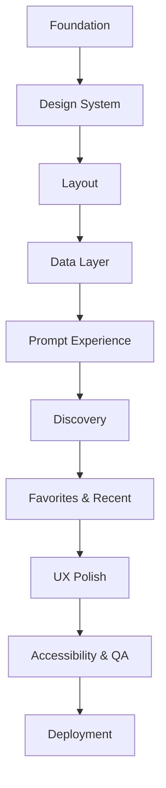
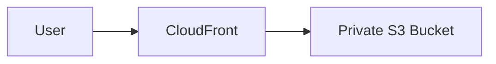
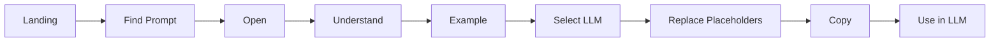

# PromptForge — AWS SBG

# Granular Implementation Plan

> Controlled, task-wise implementation plan for the PromptForge MVP. Each task is intentionally small enough to be handed to an AI/LLM independently.

## 0. Execution Rules

The project must **not** be generated as one large AI request. For every task:

1. Read this task and its prerequisites.
2. Read the relevant existing files only.
3. Give the AI/LLM the task prompt below.
4. Ask it to inspect existing code before editing.
5. Restrict changes to the task unless a dependency genuinely requires another file.
6. Review the generated code.
7. Run the validation commands.
8. Verify acceptance criteria.
9. Update `implementation-state.md`.
10. Commit the task.

### Universal AI/LLM constraints

```text
- Do not regenerate the whole project.
- Do not rewrite unrelated working code.
- Do not introduce a dependency unless the task requires it.
- Follow the existing architecture and decisions.md.
- Use TypeScript.
- Prefer existing components/utilities over duplicating functionality.
- Do not invent backend APIs.
- Do not add LLM API integrations to the MVP.
- Report assumptions and blockers.
- List every changed file.
- Provide validation steps after implementation.
```

## 1. Dependency Flow



---

# Phase 0 — Project Foundation

## IMP-001 — Initialize React + TypeScript Project

**Prerequisites:** None

**Files:** Vite project files, `package.json`, `src/`

**AI/LLM prompt:**

```text
Implement IMP-001 for PromptForge — AWS SBG.

Create the base React + TypeScript application using Vite.

Requirements:
- React
- TypeScript
- Vite
- No backend
- Minimal dependencies
- npm run dev must work
- npm run build must work

Do not implement application features yet. Do not redesign the project beyond the initial scaffold.

Return:
1. Changed files
2. Dependencies added
3. Validation commands
4. Assumptions/blockers
```

**Acceptance:** project starts, renders React, production build succeeds.

**Validation:** `npm install`, `npm run dev`, `npm run build`

---

## IMP-002 — Configure React Router

**Prerequisite:** IMP-001

**Files:** `src/app/App.tsx`, `src/app/router.tsx`, temporary page files

**AI/LLM prompt:**

```text
Implement IMP-002 for PromptForge.

Add React Router and create routes for:
/, /explore, /search, /category/:categoryId, /prompt/:promptId,
/favorites, /recent, /how-it-works, and a catch-all 404.

Create only minimal placeholder pages. Do not implement page designs or business logic.
Preserve the existing Vite/React structure.
```

**Acceptance:** all routes resolve; unknown routes show 404; build passes.

---

## IMP-003 — Establish Source Architecture

**Prerequisite:** IMP-002

Create the planned folders:

```text
src/app
src/assets/images
src/components/common
src/components/layout
src/components/search
src/components/prompts
src/components/categories
src/components/feedback
src/data/prompts
src/hooks
src/lib
src/pages
src/types
src/styles
```

**AI/LLM prompt:**

```text
Implement IMP-003.

Create the PromptForge source directory architecture from component-architecture.md.
Create only necessary minimal files. Do not invent feature implementations or fake data.
Do not add dependencies.
```

**Acceptance:** structure exists and build remains green.

---

# Phase 1 — Design System

## IMP-004 — Design Tokens

**Prerequisite:** IMP-003

Create `src/styles/tokens.css` and `globals.css`.

Tokens must cover:

- background/surfaces
- borders
- primary/secondary/muted text
- AWS-inspired orange accent
- spacing
- radius
- shadows
- typography
- transitions

Primary font: Inter. Dark-first. Include reduced-motion foundation.

**AI/LLM prompt:**

```text
Implement IMP-004 using visual-prototype.md.

Create a centralized CSS variable design-token system for PromptForge.
Use Inter, dark-first styling, an AWS-inspired orange accent without implying official AWS branding, and reusable spacing/radius/shadow/transition tokens.

Do not build page components yet. Do not scatter raw design values across the codebase.
```

**Acceptance:** tokens are centralized and global styles load correctly.

---

## IMP-005 — Configure Tailwind CSS

**Prerequisite:** IMP-004

**AI/LLM prompt:**

```text
Implement IMP-005.

Configure Tailwind CSS for the existing Vite React TypeScript project.
CSS variables remain the source of truth for design tokens. Keep configuration minimal.
Verify Tailwind classes work without duplicating the entire token system.
```

**Acceptance:** Tailwind works; build succeeds.

---

## IMP-006 — Add Icon Library

**Prerequisite:** IMP-005

Use Lucide React or another approved lightweight icon library.

**AI/LLM prompt:**

```text
Implement IMP-006.

Add the approved lightweight icon library (prefer Lucide React).
Do not create an unnecessary icon abstraction and do not modify feature screens yet.
```

---

# Phase 2 — UI Primitives

## IMP-007 — Button

**Prerequisite:** IMP-006

Create accessible `Button.tsx` with primary, secondary, ghost, disabled, focus-visible, and size variants.

**AI/LLM prompt:**

```text
Implement IMP-007.

Create a reusable, content-agnostic Button component using PromptForge tokens.
Support primary, secondary, ghost, disabled, focus-visible and size states.
Use semantic buttons and do not put application logic inside the component.
```

---

## IMP-008 — Card

**Prerequisite:** IMP-007

Create content-agnostic Card with default and interactive/hover variants.

**AI/LLM prompt:**

```text
Implement IMP-008.

Create a reusable Card primitive based on visual-prototype.md.
It must accept children, support a subtle interactive hover state, and remain independent of prompt-specific logic.
Do not build PromptCard yet.
```

---

## IMP-009 — Remaining Primitives

**Prerequisite:** IMP-008

Create:

```text
Badge
IconButton
Input
Tabs
Tooltip
```

**AI/LLM prompt:**

```text
Implement IMP-009.

Create accessible Badge, IconButton, Input, Tabs, and Tooltip primitives.
Use the existing token system and avoid feature-specific logic or unnecessary abstractions.
Support keyboard focus and semantic HTML.
```

---

# Phase 3 — Global Layout

## IMP-010 — PageContainer

**Prerequisite:** IMP-009

Create a responsive content container with approximately 1280px maximum width.

## IMP-011 — Header

**Prerequisite:** IMP-010

Create sticky Header with:

```text
PromptForge | Explore | Categories | Favorites | Recent | Search
```

Requirements: desktop/mobile structure, subtle border, accessible navigation, no search implementation inside Header.

**AI/LLM prompt:**

```text
Implement IMP-011.

Build the global PromptForge Header from visual-prototype.md.
Include branding, navigation, and a search trigger. Make it sticky, responsive, accessible, and visually restrained.
The search trigger must expose a clean callback/interface for a future SearchOverlay.
Do not implement search logic here.
```

## IMP-012 — Mobile Navigation

**Prerequisite:** IMP-011

Create accessible open/close mobile navigation, Escape handling, restrained animation, and reduced-motion support.

## IMP-013 — Footer

**Prerequisite:** IMP-011

Create minimal responsive footer with PromptForge identity, AWS SBG context, navigation and appropriate non-official-product clarification if needed.

## IMP-014 — Global Layout

**Prerequisite:** IMP-013

Compose Header + main + Footer through the application/router without page-specific logic.

**Acceptance for IMP-010–014:** all routes use the layout; mobile navigation works; build succeeds.

---

# Phase 4 — Data and Types

## IMP-015 — TypeScript Domain Types

**Prerequisite:** IMP-014

Create:

```ts
type LLM = "chatgpt" | "gemini";
interface Prompt { ... }
interface PromptExample { ... }
interface Category { ... }
```

Prompt fields must support id, title, description, categoryId, tags, supported LLMs, instructions, requirements, variants and optional example.

**AI/LLM prompt:**

```text
Implement IMP-015 using component-architecture.md.
Create strongly typed Prompt, Category, LLM, PromptVariant and PromptExample models.
MVP LLMs are chatgpt and gemini. Avoid any and do not add runtime logic.
```

## IMP-016 — Category Dataset

**Prerequisite:** IMP-015

Create initial categories:

```text
Communication
Events
Content
Presentations
Creative
Technical
Planning
Productivity
```

Keep them data-driven and easy to extend.

## IMP-017 — Prompt Dataset

**Prerequisite:** IMP-016

Create the prompt data layer and 5–10 representative prompts initially. Each must include ChatGPT and Gemini variants and useful instructions/requirements. Use `{{PLACEHOLDER}}` syntax.

**Important:** do not attempt the entire 20–30 prompt library in this coding task. Content can be added in separate content tasks later.

## IMP-018 — Prompt Utilities

**Prerequisite:** IMP-017

Create pure utilities:

```text
getPromptById
getPromptsByCategory
extractPlaceholders
hasUnfilledPlaceholders
getPromptVariant
```

No React dependency; deterministic and testable.

---

# Phase 5 — Core Prompt Experience

## IMP-019 — PromptCard

**Prerequisite:** IMP-018

Display category, title, description, tags, supported LLMs and navigation. Favorite action may initially be a presentational interface only.

## IMP-020 — PromptGrid

**Prerequisite:** IMP-019

Responsive 3/2/1 column grid. Accept prompt collection and empty state. Filtering/search logic must remain outside.

## IMP-021 — LLMSelector

**Prerequisite:** IMP-019

Controlled, accessible ChatGPT/Gemini segmented control with keyboard support.

## IMP-022 — Placeholder Highlighting

**Prerequisite:** IMP-018

Render `{{PLACEHOLDER}}` tokens distinctly while preserving formatting. Avoid unsafe HTML rendering.

## IMP-023 — PromptViewer

**Prerequisite:** IMP-022

Monospace, readable, scrollable, responsive prompt presentation with placeholder highlighting.

## IMP-024 — useClipboard

**Prerequisite:** IMP-021

Implement async Clipboard API hook with copied/error state and reset timeout. No global state.

## IMP-025 — CopyPromptButton

**Prerequisite:** IMP-024

States: Copy Prompt, Copying if needed, Copied, Error. Accept final prompt string and use useClipboard.

## IMP-026 — PlaceholderWarning

**Prerequisite:** IMP-018

Show count of remaining placeholders and guidance. Hide when zero.

## IMP-027 — PromptInstructions + PromptRequirements

**Prerequisite:** IMP-019

Display what the prompt does, how to use it, and required inputs. Keep scannable and data-driven.

## IMP-028 — PromptExample

**Prerequisite:** IMP-027

Display scenario, input values, completed prompt and optional expected result.

## IMP-029 — PromptWorkspace

**Prerequisites:** IMP-021, IMP-023, IMP-025, IMP-026

Compose LLM selector, viewer, placeholder warning and copy button. Track selected LLM locally. Select the correct variant from the prompt.

## IMP-030 — Prompt Detail Page

**Prerequisites:** IMP-028, IMP-029

Build the main PromptPage:

```text
Back/breadcrumb
Category
Title
Description
Favorite interface
Instructions
Requirements
Example
Prompt Workspace
```

Prompt workspace must dominate the interaction area. Invalid IDs must show a proper not-found state.

**AI/LLM prompt for IMP-030:**

```text
Implement IMP-030 for PromptForge.

Use the existing PromptPage route parameter and central prompt data/utilities.
Compose only existing/relevant prompt components.
The page must explain the prompt, show requirements and example, provide ChatGPT/Gemini selection, highlight placeholders, warn about incomplete placeholders, and provide Copy Prompt.
Do not duplicate prompt data inside JSX.
Do not introduce global state or a backend.
```

---

# Phase 6 — Discovery

## IMP-031 — HomePage

**Prerequisites:** IMP-020, IMP-030

Build hero, dominant search entry, concise value proposition, Explore CTA and a curated discovery section. Do not show the entire library on the landing page.

## IMP-032 — ExplorePage

**Prerequisite:** IMP-020

Build heading, category filters, prompt grid, active filter and empty state. Filtering stays outside PromptGrid.

## IMP-033 — CategoryPage

**Prerequisites:** IMP-018, IMP-020

Read `categoryId`, show category information and relevant prompts, handle invalid category.

## IMP-034 — Search Utility

**Prerequisite:** IMP-018

Implement deterministic normalized search. Ranking:

```text
Exact title
Title contains
Tag
Category
Description
```

No fuzzy-search dependency initially.

## IMP-035 — Search UI

**Prerequisites:** IMP-034, IMP-031

Create SearchBar, SearchOverlay, SearchResults, SearchResultItem. Support Ctrl/Cmd+K, Escape, keyboard selection, empty state, responsive behavior and accessibility.

## IMP-036 — SearchPage

**Prerequisite:** IMP-035

Read `q` from URL query string; show query, count, results, empty state and clear action.

---

# Phase 7 — Personalization

## IMP-037 — Storage Utility

**Prerequisite:** IMP-030

Create typed, defensive localStorage helpers. Handle unavailable/corrupt storage gracefully.

## IMP-038 — useFavorites

**Prerequisite:** IMP-037

Store only prompt IDs under `promptforge:favorites`. Prevent duplicates and expose favorite/unfavorite state.

## IMP-039 — Connect Favorites

**Prerequisite:** IMP-038

Connect favorite state to PromptCard and PromptPage. Use ☆/★ or equivalent accessible icons.

## IMP-040 — FavoritesPage

**Prerequisite:** IMP-039

Resolve saved IDs against central prompt data and display PromptGrid/empty state.

## IMP-041 — useRecent

**Prerequisite:** IMP-037

Store maximum 10 prompt IDs under `promptforge:recent`, newest first; opening an existing prompt moves it to the top.

## IMP-042 — Recent Tracking

**Prerequisite:** IMP-041

Record valid prompt IDs when PromptPage opens.

## IMP-043 — RecentPage

**Prerequisite:** IMP-042

Display recent prompts or empty state. Resolve IDs through central data.

---

# Phase 8 — UX Polish

## IMP-044 — Loading/Skeleton States

Add only where meaningful; do not add artificial delays to a static application.

## IMP-045 — Error States

Create reusable states for invalid prompt/category, clipboard failure and storage failure.

## IMP-046 — Page Transitions

Use subtle opacity/4px translate transitions and respect reduced motion.

## IMP-047 — Microinteractions

Polish card hover, buttons, favorites, copy success, search focus and mobile menu. Animation must communicate state rather than decorate.

## IMP-048 — Responsive Polish

Test and refine 320, 375, 430, 768, 1024, 1280 and 1440px widths without changing information architecture.

---

# Phase 9 — Accessibility and QA

## IMP-049 — Keyboard Audit

Verify Tab, Shift+Tab, Enter, Space, Escape, arrows where applicable, Ctrl/Cmd+K. Fix only confirmed issues.

## IMP-050 — Semantic/Screen Reader Audit

Check headings, landmarks, links/buttons, labels, aria-selected, aria-expanded, focus management and semantic HTML.

## IMP-051 — Reduced Motion Audit

Verify all animations respect `prefers-reduced-motion`.

## IMP-052 — Functional QA

```text
[ ] Home
[ ] Explore
[ ] Search
[ ] Categories
[ ] Prompt detail
[ ] ChatGPT variant
[ ] Gemini variant
[ ] Placeholder detection
[ ] Copy
[ ] Favorites
[ ] Recent
[ ] Empty states
[ ] Invalid routes
[ ] Mobile navigation
```

## IMP-053 — Production Build Audit

Run `npm run build`; inspect TypeScript errors, console errors, broken assets/routes, missing keys and obvious bundle issues.

---

# Phase 10 — Deployment

## IMP-054 — Production Static Build

Ensure correct asset paths, SPA compatibility, no backend dependency and no secrets.

## IMP-055 — S3 Deployment

Deploy `dist/` to a private S3 bucket. S3 website hosting is not required.

## IMP-056 — CloudFront

Preferred architecture:



Configure HTTPS, Origin Access Control, caching/compression and SPA fallback behavior.

## IMP-057 — Production Smoke Test

Verify homepage, direct prompt URLs, search, HTTPS clipboard, localStorage, mobile behavior, cache behavior and console cleanliness.

---

# Final Validation

## IMP-058 — End-to-End User Journey



A new AWS SBG member should complete the flow without assistance.

---

# AI/LLM Task Prompt Template

Use this for every future coding request:

```text
PROJECT:
PromptForge — AWS SBG

TASK:
IMP-XXX — [Task name]

CONTEXT:
[Only relevant sections of requirements/architecture/visual docs]

PREREQUISITES:
[Completed task IDs]

EXISTING FILES:
[List actual relevant files]

REQUIREMENTS:
[Task requirements]

CONSTRAINTS:
- Do not rewrite unrelated code.
- Do not introduce dependencies unless required.
- Follow decisions.md.
- Follow existing architecture.
- Use TypeScript.
- Preserve working behavior.

ACCEPTANCE CRITERIA:
[Checklist]

OUTPUT:
1. Modify/create required files.
2. Summarize changes.
3. List assumptions.
4. Give validation commands.
5. Report blockers.
```

# Context Strategy

Do not give every document to the AI for every task.

```text
UI task → visual-prototype + relevant architecture + existing files
Data task → types/data architecture + existing data
Deployment → code deployment section + current AWS configuration
```

The smaller the relevant context, the easier it is to control generated code and reduce hallucination.

# Core Rule

> **Never ask an AI/LLM to “build the whole PromptForge project.” Ask it to implement one numbered task.**
