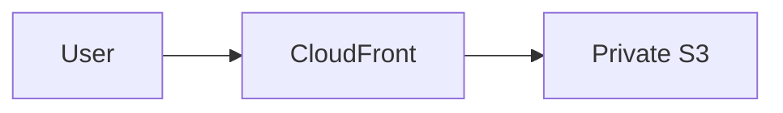
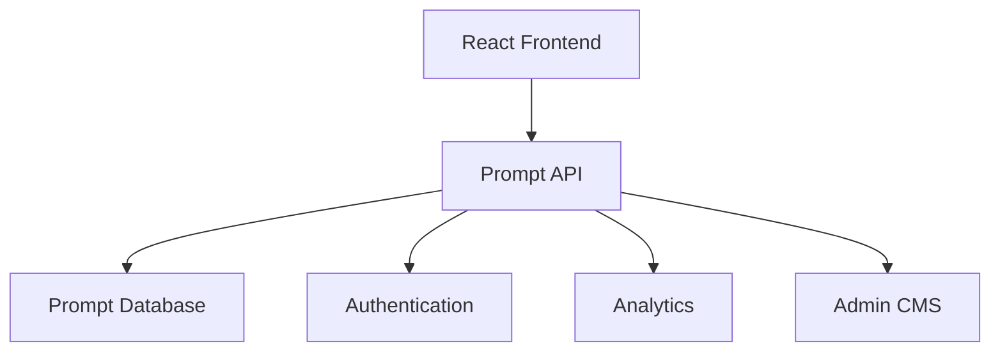
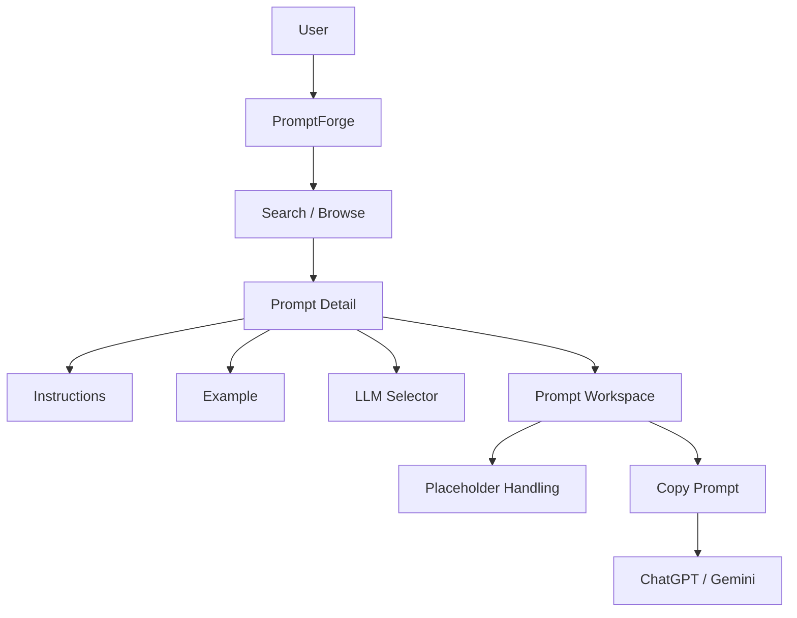

# PromptForge — AWS SBG
# Development Decisions

> Authoritative decision log. New decisions should be appended rather than silently changing accepted architecture.

## Decision Format

Every new decision should record:

- ID
- Date
- Status
- Decision
- Rationale
- Consequences when relevant

---

## DEC-001 — Prompt Template Library

**Date:** 2026-08-11  
**Status:** Accepted

PromptForge is initially a reusable AI prompt-template library, not a direct AI automation platform.

**Rationale:** The immediate problem is repetitive prompt construction. The desired workflow is:

```text
Find → Understand → Fill placeholders → Copy → Use
```

---

## DEC-002 — AWS SBG First

**Date:** 2026-08-11  
**Status:** Accepted

The MVP targets AWS Student Builder Group first.

Potential future organizational versions:

```text
AWS Academy
Red Hat Academy
Oracle Academy
M.H. Saboo Siddik College
```

**Rationale:** Validate the product with one organization before generalizing.

---

## DEC-003 — Organization-Specific Context

**Date:** 2026-08-11  
**Status:** Accepted

Prompts may contain organization-specific terminology, workflows, roles, communication styles and conventions.

**Rationale:** Different organizations have different contexts; forcing every user to supply that context defeats the time-saving goal.

---

## DEC-004 — Templates for Organization, Workflows for Personal Use

**Date:** 2026-08-11  
**Status:** Accepted

The organization-facing product uses templates. A future personal system may use a context-aware AI workflow.

```text
Organization → standardized template + user context
Personal → known context + AI workflow
```

---

## DEC-005 — React

**Date:** 2026-08-11  
**Status:** Accepted

React is the frontend framework for the MVP because the product has interactive search, filtering, prompt selection, LLM switching, favorites and recent history.

---

## DEC-006 — TypeScript

**Date:** 2026-08-11  
**Status:** Accepted

TypeScript is used for stronger domain modeling and safer task-wise AI code generation.

---

## DEC-007 — Static MVP

**Date:** 2026-08-11  
**Status:** Accepted

The MVP is a static React application. No backend, database or authentication is required initially.

**Rationale:** The initial prompt dataset is static and the product does not need server-side computation.

---

## DEC-008 — No Direct LLM API Integration

**Date:** 2026-08-11  
**Status:** Accepted

PromptForge does not directly call ChatGPT/Gemini APIs in the MVP.

```text
PromptForge → Copy → External LLM
```

**Rationale:** Avoid API keys, API cost, backend complexity and model-provider coupling.

---

## DEC-009 — ChatGPT and Gemini First

**Date:** 2026-08-11  
**Status:** Accepted

Initial prompt variants support ChatGPT and Gemini. The data model must permit future LLMs without architectural changes.

---

## DEC-010 — LLM Selector on Prompt Page

**Date:** 2026-08-11  
**Status:** Accepted

Users select ChatGPT or Gemini directly inside the prompt workspace.

```text
[ ChatGPT ] [ Gemini ]
```

**Rationale:** Switching models should not require changing pages.

---

## DEC-011 — Placeholder Syntax

**Date:** 2026-08-11  
**Status:** Accepted

Templates use:

```text
{{PLACEHOLDER}}
```

**Rationale:** Easy for users to recognize and for code to parse deterministically.

---

## DEC-012 — Placeholder Warning

**Date:** 2026-08-11  
**Status:** Accepted

The UI warns when placeholders remain before copying.

---

## DEC-013 — Prompt Instructions

**Date:** 2026-08-11  
**Status:** Accepted

Every prompt should explain what it does, how to use it and what information is required.

**Rationale:** PromptForge should be usable by people who are not expert prompt engineers.

---

## DEC-014 — Prompt Examples

**Date:** 2026-08-11  
**Status:** Accepted

Prompts should include a practical example where useful, including how placeholders are filled. An expected result may be included when it adds value.

---

## DEC-015 — Search as Primary UX

**Date:** 2026-08-11  
**Status:** Accepted

Search is prominent on the landing page and globally accessible.

**Rationale:** The product's core value is saving time finding the right prompt.

---

## DEC-016 — Deterministic Search Ranking

**Date:** 2026-08-11  
**Status:** Accepted

Initial ranking:

```text
Exact title
→ title match
→ tag match
→ category match
→ description match
```

No fuzzy-search dependency initially.

---

## DEC-017 — Favorites via localStorage

**Date:** 2026-08-11  
**Status:** Accepted

Favorites are stored locally by prompt ID. No account is required.

---

## DEC-018 — Recent via localStorage

**Date:** 2026-08-11  
**Status:** Accepted

Recent prompts are stored locally by prompt ID, maximum 10, newest first.

---

## DEC-019 — No Global State Library Initially

**Date:** 2026-08-11  
**Status:** Accepted

Do not introduce Zustand/Redux unless actual MVP complexity demonstrates a need.

**Rationale:** React state, hooks and localStorage are sufficient initially.

---

## DEC-020 — Prompt Data Separate from UI

**Date:** 2026-08-11  
**Status:** Accepted

Prompt content lives in static data files, never inside page JSX.

**Goal:** Adding a prompt should require adding data, not modifying core application logic.

---

## DEC-021 — Content-Driven Architecture

**Date:** 2026-08-11  
**Status:** Accepted

The application should scale by adding prompt objects rather than creating new components for each prompt.

```text
One prompt object
→ Home / Explore / Search / Category / Favorites / Recent / Detail
```

---

## DEC-022 — Dark-First Theme

**Date:** 2026-08-11  
**Status:** Accepted

The visual system is dark-first, with future light-theme support possible.

---

## DEC-023 — Inter Font

**Date:** 2026-08-11  
**Status:** Accepted

Inter is the primary UI font. Prompt content may use a readable monospace font.

---

## DEC-024 — AWS-Inspired Accent, Not Official AWS Branding

**Date:** 2026-08-11  
**Status:** Accepted

The design can use an AWS-inspired orange accent but must not imply PromptForge is an official AWS product.

---

## DEC-025 — Minimal Technical Premium UI

**Date:** 2026-08-11  
**Status:** Accepted

The interface should be minimal, technical, premium, fast and readable. Avoid excessive glassmorphism, gradients, decorative clutter and oversized illustrations.

---

## DEC-026 — Functional Motion

**Date:** 2026-08-11  
**Status:** Accepted

Animation is used for navigation, focus, interaction and state changes, not decoration. Reduced-motion preferences must be respected.

---

## DEC-027 — Responsive by Default

**Date:** 2026-08-11  
**Status:** Accepted

Support mobile, tablet and desktop. Planned test widths include 320, 375, 430, 768, 1024, 1280 and 1440px.

---

## DEC-028 — Accessibility Is MVP Scope

**Date:** 2026-08-11  
**Status:** Accepted

Keyboard navigation, visible focus, semantic HTML, accessible controls, adequate contrast, touch targets and reduced motion are part of the MVP.

---

## DEC-029 — Task-Wise AI/LLM Development

**Date:** 2026-08-11  
**Status:** Accepted

The project will be implemented as small numbered tasks rather than one whole-project generation request.

**Rationale:** This reduces hallucinations, uncontrolled changes, architectural drift and debugging complexity.

```text
Task → Minimal Context → AI Code → Review → Validate → State Update → Commit
```

---

## DEC-030 — Minimal Context per AI Task

**Date:** 2026-08-11  
**Status:** Accepted

Only the relevant planning sections and existing files should be supplied to an AI for a task.

**Rationale:** Smaller context improves focus and reduces irrelevant generation.

---

## DEC-031 — Thin Pages

**Date:** 2026-08-11  
**Status:** Accepted

Pages should primarily compose reusable components. Business logic should live in hooks, utilities and data layers where appropriate.

---

## DEC-032 — Feature-Oriented Components

**Date:** 2026-08-11  
**Status:** Accepted

Components are organized by feature (`prompts`, `search`, `categories`, `layout`, `common`) rather than creating a monolithic component system.

---

## DEC-033 — No Premature Abstraction

**Date:** 2026-08-11  
**Status:** Accepted

Create abstractions when they solve a real repeated problem. Do not abstract merely because two components currently look similar.

---

## DEC-034 — S3 + CloudFront Deployment

**Date:** 2026-08-11  
**Status:** Accepted

Preferred AWS production architecture:



Use CloudFront as the public delivery layer.

---

## DEC-035 — Private S3 Bucket

**Date:** 2026-08-11  
**Status:** Accepted

The S3 bucket should remain private when CloudFront is used, with appropriate CloudFront origin access.

---

## DEC-036 — S3 Website Hosting Not Required

**Date:** 2026-08-11  
**Status:** Accepted

Do not enable S3 static website hosting for the CloudFront/private-bucket architecture.

---

## DEC-037 — Future Multi-Organization Support

**Date:** 2026-08-11  
**Status:** Accepted

The architecture should remain capable of adding `organizationId` later, but multi-organization UI is intentionally outside the MVP.

---

## DEC-038 — Future Backend Boundary

**Date:** 2026-08-11  
**Status:** Accepted

Authentication, analytics, admin management, prompt versioning and organizational management may later be added behind a backend/API boundary.



This is future scope only.

---

## DEC-039 — Initial Prompt Library Size

**Date:** 2026-08-11  
**Status:** Accepted

Start with approximately 20–30 curated high-value prompts rather than trying to cover every possible task.

Suggested categories:

```text
Communication
Events
Content
Presentations
Creative
Technical
Planning
Productivity
```

---

## DEC-040 — Prompt Detail Is the Core Experience

**Date:** 2026-08-11  
**Status:** Accepted

The prompt detail page is the most important application surface. It must combine:

```text
What it does
How to use
Requirements
Example
LLM selection
Prompt
Placeholder status
Copy action
```

---

## DEC-041 — Copy Is the Primary Action

**Date:** 2026-08-11  
**Status:** Accepted

The principal action is `Copy Prompt`, because the MVP prepares prompts rather than executing them.

---

## DEC-042 — No Structured Placeholder Form in MVP

**Date:** 2026-08-11  
**Status:** Accepted

Users replace `{{PLACEHOLDER}}` values manually in the prompt. A form-based customization system can be considered later.

---

## DEC-043 — No Provider API Assumptions

**Date:** 2026-08-11  
**Status:** Accepted

PromptForge prepares plain text prompts and does not assume proprietary API formats or model-specific API behavior beyond maintaining separate prompt variants.

---

# Pending Decisions

| ID | Decision | Status |
|---|---|---|
| PDEC-001 | Final PromptForge logo/wordmark | Pending |
| PDEC-002 | Final category icon set | Pending |
| PDEC-003 | Final 20–30 prompt dataset | Pending |
| PDEC-004 | Whether examples include expected outputs | Pending |
| PDEC-005 | Production domain | Pending |
| PDEC-006 | Analytics requirement | Pending |
| PDEC-007 | Light theme requirement | Pending |
| PDEC-008 | Prompt versioning | Pending |
| PDEC-009 | CMS/database migration | Pending |
| PDEC-010 | Structured placeholder form | Pending |

# Decision Change Policy

Never silently overwrite an accepted decision.

When a decision changes:

1. Add a new decision ID.
2. Reference the old decision.
3. Explain why it changed.
4. Record the date.
5. Mark the previous decision as superseded where appropriate.

Example:

```text
DEC-XXX — Supersedes DEC-019

Decision: Introduce global state after measured complexity requires it.
Reason: [evidence]
```

# Architectural North Star



The MVP should remain fast, curated, understandable, organization-aware, LLM-agnostic, static and maintainable until actual product requirements justify architectural change.
